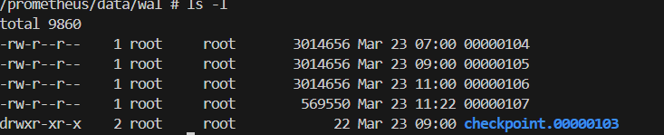
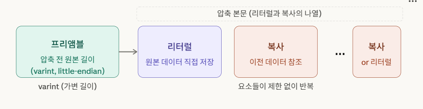
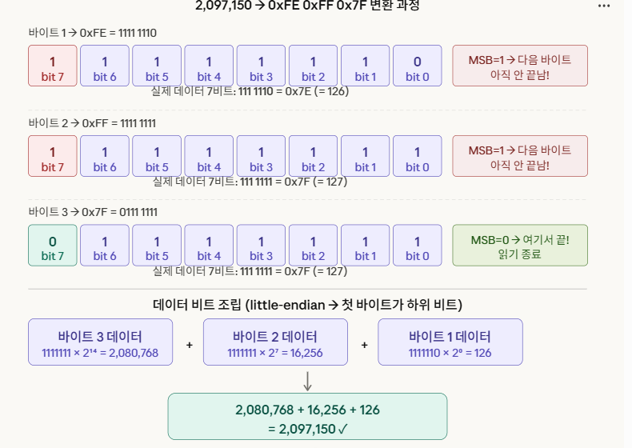
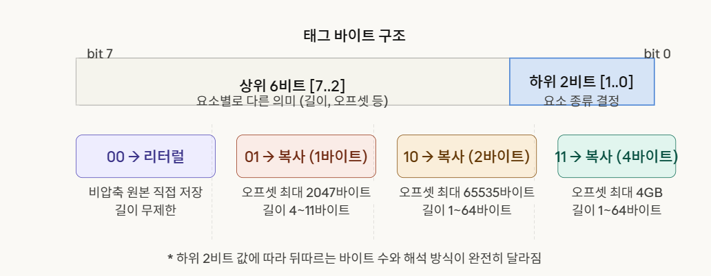
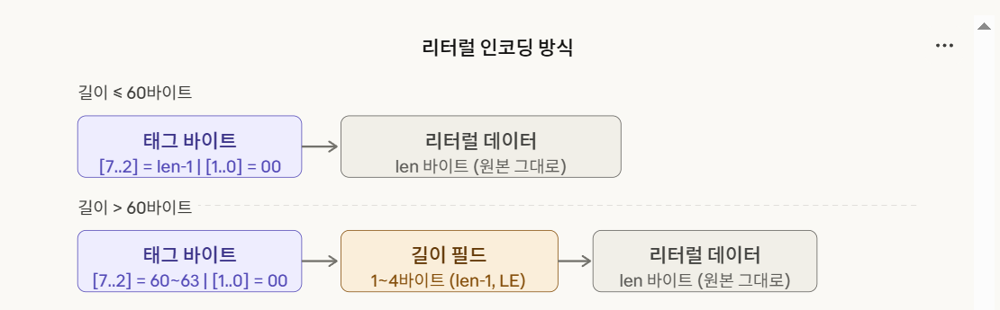
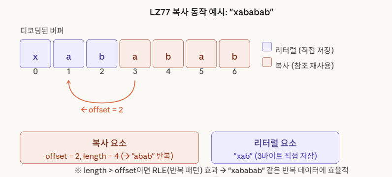
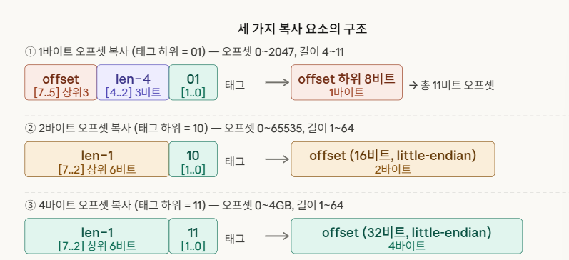
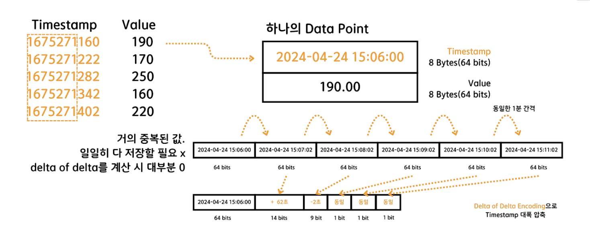
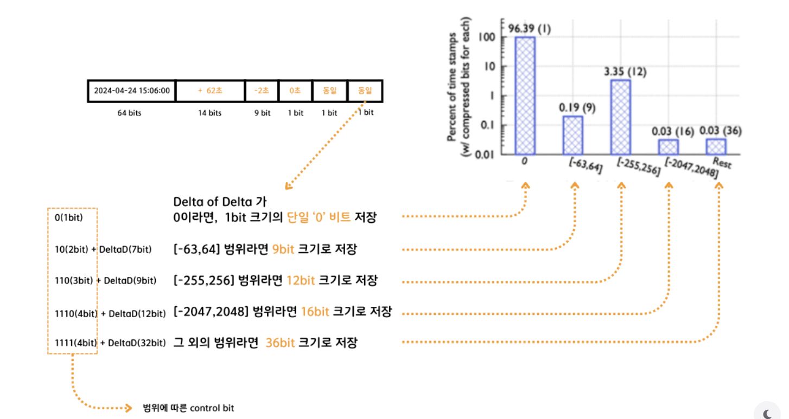
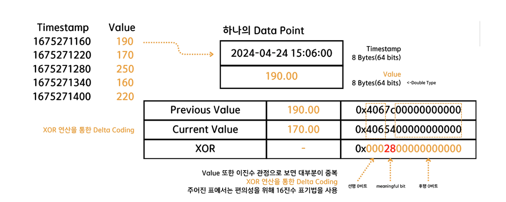

## WAL 이란(Write-ahead-Log)

데이터베이스에서 발생하는 사건들의 순차적 로그이다. 데이터베이스에 쓰기/수정/삭제 등 트랜잭션 수행전에 미리
WAL에 기록하고 크래시가 발생시에 WAL에 이벤트가 기록되어 같은 순서로 데이터베이스를 재생할 수 있다.
이벤트 기록과 시작 시 메모리 상태 복원에만 사용됩니다.
읽기 또는 쓰기 연산에는 다른 방식으로 개입하지 않습니다.



체크포인트 생성 확인 가능하다.

## 체크섬
checksum 이란?
```
데이터 전송이나 저장 과정에서 데이터에 오류가 발생했는지 확인하기 위한 짧은 숫자값
```
## WAL 압축방식 (Snappy)

글이 C++로 작성한 빠른 데이터 압축 및 압축 해제 라이브러리로, 2011년에 오픈 소스로 공개

기존 압축 알고리즘들이 가지고 있는 문제들을 해결하기 위해 만들어졌다.
비교

gzip : 압축률은 좋지만 압축속도가 느림
zlib : 범용성이 좋지 않으며 CPU 많이사용
LZMA : 압축률이 매우 좋으나 그만큼 느림

특징 

엄청 빠르다/압축률은 낮다/스트리밍 블록처리에 강하다 등등....

## 스트림의 구조

### 프리앰블



스트림의 첫번째 바이트들은 압축 전 원본 데이터의 크기를 담습니다.
이를 가변 길이 정수로 저장하는데 하위 7bit가 Data이고 최상위 비트가 1이면 다음 Byte가 더 있다는 뜻이다.

예시)




### 압축 본문 : 태그 바이트

본문의 모든 요소는 태그 바이트로 시작하며 , 태그 바이트의 하위 2비트가 요소의 종류를 결정한다. 





00 리터럴 

압축하지 않은 원본 데이터를 그대로 저장한다. 길이에 따라 인코딩 방식이 달라집니다.

길이가 60바이트 이하인 리터럴의 경우에, 길이 필드는 태그바이트에 포함된다.

길이가 60비트 이상인 리터럴의 경우에, 길이 필드는 따로 분리된다. 상위 6비트의 값이 60~63
일 수 있고, 길이 필드의 바이트크기는 1~4가 된다.




LZ77 

복사 요소는 이미 디코딩된 데이터를 뒤돌아보며 재사용하는 것이다. 

두 값을 담습니다. 오프셋(얼마나 뒤를 보는지)과 길이(몇 바이트를 복사할지), 길이가 오프셋보다 크면 RLE(반복 인코딩) 효과도 납니다.

리터럴 요소 : xab (3바이트 직접 저장)

복사요소 : 오프셋 = 2 / 길이 = 4 (-> "abab"  반복)




1. 1바이트 오프셋 복사 (태그 하위 = 01) 
2. 2바이트 오프셋 복사 (태그 하위 = 10) 
3. 4바이트 오프셋 복사 (태그 하위 = 11)
 


태그바이트의 하위 2비트에 뭐가 오는지에 따라 따라 뒤따르는 바이트 수가 달라집니다.

태그하위가 01일 경우 오프셋 11비트를 표현해야하는 데 1바이트만 뒤 따르기 때문에 태그바이트에서 3비트를 할당하여 오프셋을 표현해야한다.

결론 요약 : Snappy는 varint로 원본 크기를 먼저 알려준 뒤, 태그 바이트가 이끄는 리터럴 (원본 그대로)과 복사(뒤돌아보기)의 연속으로 데이터를 표현하는 단순하고 빠른 LZ77 압축포맷이다.

## 고릴라 알고리즘
시계열 데이터 압축에 있어서 페이스북에서 2015년에 개발한 알고리즘
기본적으로 프로메테우스는 (timestamp, value) 형태로 시계열 데이터를 저장한다.
Timestamp는 밀리초단위로 기록된다.
2가지의 알고리즘으로 시계열 데이터의 timestamp 와 Value를 압축하는데,
2개의 압축 전부 비손실 압축으로 압축 전과 후 완전히 동일한 복구를 보장한다.


### TimeStamp 압축  
고릴라 알고리즘의 TimeStamp 압축은 시계열 데이터의 TimeStamp값을 압축한다.
TimeStamp Data 포인트는 해당 시간의 TimeStamp 를 나타내는 64bit 값쌍으로 구성.
TimeStamp 데이터는 일정한 주기로 데이터를 기록한다는 점이 고릴라 알고리즘의 해당 압축을 가능하게 만든다.

Delta-Delta 기법 사용을 사용한다. 
Delta-Delta 기법이란? 차이점 에서 차이점을 빼는 방식.
만약 오차가 존재하지 않는다면 3번째 시계열 데이터 부터 1비트로 대폭 압축이 가능해진다.



예시 사진에 따르면 타임스탬프가 1675271160 , 1675271222, 1675271282 ... 이런 순으로 저장되어 있는 것을 확인할 수 있다.
당연히 타임스탬프를 찍는 주기가 연단위나 월단위는 아닐 것이므로 앞자리 대부분은 겹칠 것이다.
예시를 살펴보자면 첫번째 ~ 두번째 데이터는 62초 차이고 세번째부터는 60초로 동일하다.

그렇다면 첫번째 데이터는 그대로 저장되고 두번째 데이터는 첫번째 데이터로 부터의 차이값인 + 62초가 저장된다.
세번째 데이터는 두번째 데이터로 부터 60초 이후에 찍혔으므로 두번째 데이터와의 차이값이 -2초가 기록된다.
그 후부터는 주기가 완벽히 동일하기에 0초로 계속 찍히게 되는것이다.

오차에 대한 처리도 추가적으로 되어야한다.
오차에 대한 처리는 총 다섯 가지의 분기로 처리되고 이를 처리하기 위해선 "Control bit"라는 것이 필요하다고 한다.

제어 비트 : 어떻게 해석해야 하는지 알려주는 지시서

데이터 비트 : 실제 읽어들여야할 정보값을 이진수로 표현한것



뒤에 따로오는 DeltaData(=Data Bit)는 Delta-Delta 계산값을 범위 안에서 이진수로 표현한 것이다.
예를 들어 3번 -2초의 경우 -63 64 범위 안이기 때문에 맨 앞에 10 제어비트가 오게 되고 0000010의 데이터비트가 오게되어
100000010 이라는 9비트로 압축되어 저장되게 된다.

그런데 예시에서 예외가 하나있다.
어라 ? + 62초면 9bit로 저장되어야 하는 거 아닌가요? 

원래라면 그것이 맞으나 두 번째 데이터는 Delta-Delta 계산값이 아닌 첫번째 델타이기 때문에 비교할 차잇값이 없다.
따라서 고릴라 알고리즘에서는 두번째 데이터를 제어비트없이도 고정길이로 읽을 수 있도록 14비트로 고정하였다.

### value 압축

부동 소수점 데이터 (floating data)를 압축
Value 압축은 두 가지 핵심 개념
부동소수점과 배타논리합(XOR) 연산이다.

가장 먼저 초기값을 이진화하여 비트 시퀀스에 저장하게된다.
즉 첫번째 Value는 이진화되어서 그대로 비트 시퀀스에서 저장되게 된다.
중요한 건 두번째 Value 부터인데 두번 째 Value 부터는 이진화된 값을 바로 저장하는 것이 아니라 이전 값과의 XOR 연산을 한다.



사진 자료에는 이해를 쉽게 돕기 위해 16진수와 2진수가 혼합되어서 사용된 것으로 보인다.
예시로 나온 Value를 분석해보겠다. 
두 Value에서 일치하는 선행 0비트와 후행 0비트를 제외하면 두 Value의 차이는 7c와 54이다.
이를 16진수에서 2진수로 치환하면 0111 1100 ,0101 0100 이다. 이 둘을 빼면 28이 나오는 간단한 연산의 값이
바로 meaningful bit가 되는 것이다. 

그럼 중요한 것은 저렇게 XOR 연산이 완료된 값을 어떻게 저장하느냐인데 3가지 분류로 나누어진다고 한다.

중요한건 이전 XOR 의 값을 알고 있어야 한다고 한다.
1. XOR 연산의 결과가 0 인경우(일치)
쉬운 문제이다. 값이 같다면 당연히 1비트의 0을 저장할 것이다.

2. 비트의 범위가 일치하는 경우

비트의 범위가 이전 XOR 과 완전히 동일하거나 선행 0의 개수만 더 적다면 동일 비트 범위로 판단한다.
비트의 범위가 일치하다면 컨트롤 비트로 10을 찍고 meaninfulbit를 저장한다.

3. 비트의 범위가 일치하지 않는 경우

후행의 개수가 이전 XOR 과 비교하여 더 적다면 비트의 범위가 일치하지 않다고 생각하고 컨트롤 비트를 11을 찍고
선행 0비트의 개수 와 meaningfulbit 길이, meanningful 비트를 저장한다

첫번째 데이터는 그대로 이진수로 저장되기 때문에 두번째 데이터는 비교할 XOR 연산이 없다.
그리고 그대로 저장된 이진수와 XOR 연산을 거친 두번째 데이터가 비트 범위가 같을리도 없기 때문에 3번 케이스 
즉, 무조건 컨트롤 비트 11로 저장된다.

고릴라 알고리즘 분석글 출처 : https://wn1331.tistory.com/274