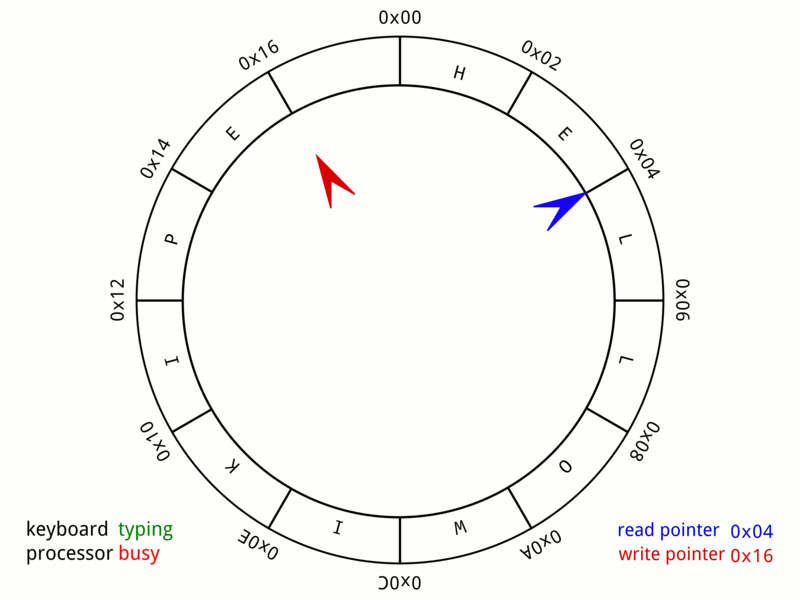
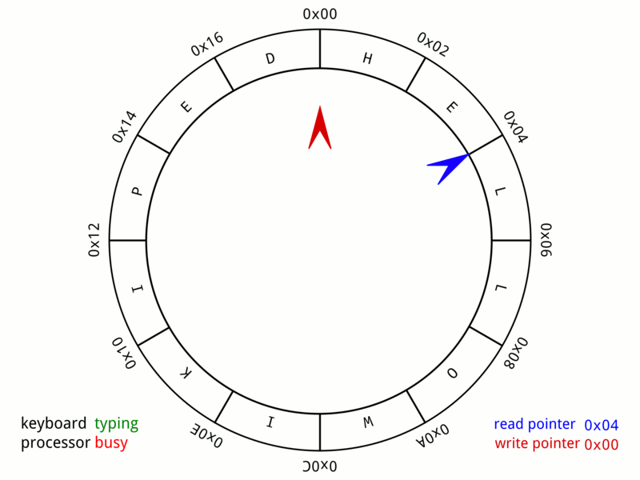
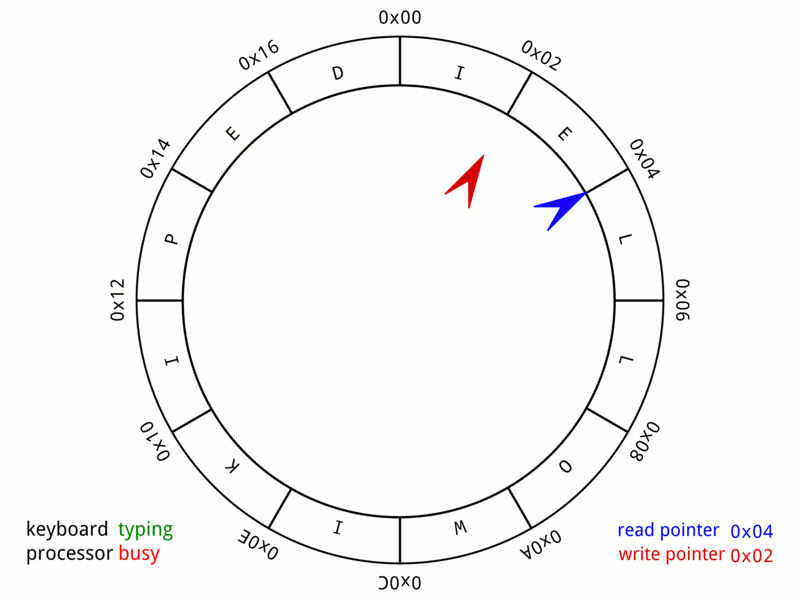
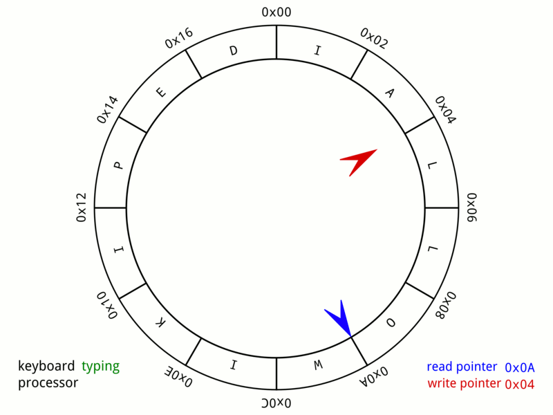
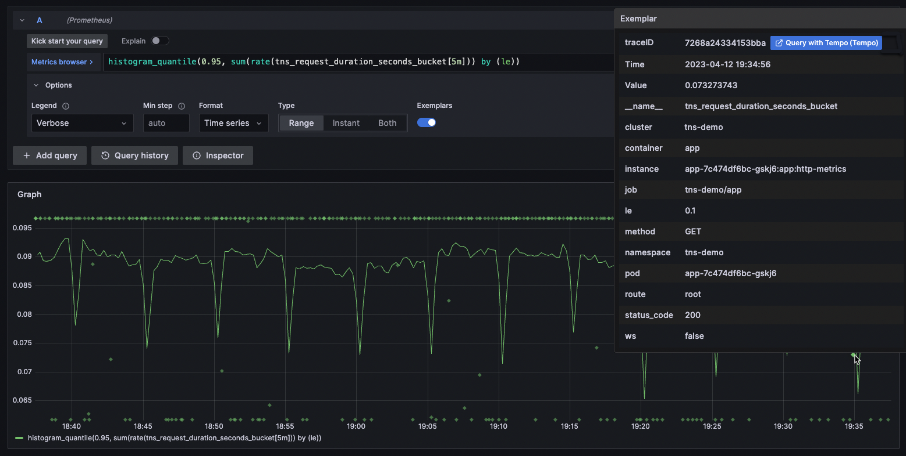

# Prometheus TSDB: Circular Buffer, Exemplar

## 0. Overview

이 문서는 Prometheus v2.30.0에서 도입된  
**memory snapshot on shutdown** 기능을 바탕으로, 그 안에서 함께 다뤄지는 자료구조 및 시계열 개념을 정리한다.

다루는 개념은 다음 두 가지다.

- Circular Buffer(원형 버퍼)
- Exemplar(엑셈플러 / 표본)

memory snapshot on shutdown은 Prometheus가 종료될 때 Head block의 in-memory 상태를 snapshot으로 저장해두고, 다음 재시작 시 WAL replay를 줄이기 위한 기능이다.

이때 snapshot에는 다음 데이터가 포함된다.

- Head block에 존재하는 모든 time series와 각 series의 in-memory chunk
- Head block의 모든 tombstone
- Head block의 모든 exemplar

여기서 중요한 점은 snapshot이 단순히 series와 chunk만 저장하는 것이 아니라,  
Head block 안에 존재하는 exemplar까지 함께 저장한다는 것이다.

Prometheus에서 exemplar는 제한된 메모리 안에서 관리되며, circular buffer의 순서와 밀접하게 연결된다.  
따라서 snapshot을 복원할 때도 exemplar를 단순히 값의 집합으로 복원하는 것이 아니라,  
기존 circular buffer에 기록된 순서를 유지하는 방식으로 복원해야 한다.

---

# 1. Circular Buffer

## 1.1 Definition

Circular Buffer(원형 버퍼)는 고정된 크기의 배열을 원형처럼 사용하는 자료구조다.

일반적인 배열은 마지막 위치에 도달하면 더 이상 뒤에 데이터를 추가할 공간이 없지만, circular buffer는 마지막 위치 다음을 다시 첫 번째 위치로 연결된 것처럼 다룬다.

데이터 처리 관점에서는 주로 FIFO(First In First Out) 방식으로 이해할 수 있다.  
먼저 들어온 데이터가 먼저 읽히고, 버퍼가 가득 찬 상태에서는 **가장 오래된 데이터**가 새 데이터에 의해 덮어써진다.

```text
capacity = 5

index:
 0   1   2   3   4
[ ] [ ] [ ] [ ] [ ]
```

데이터를 순서대로 넣으면 다음과 같이 채워진다.

```text
A -> B -> C -> D -> E

index:
 0   1   2   3   4
[A] [B] [C] [D] [E]
```

이 상태에서 새 데이터 `F`를 추가하면, 버퍼의 끝 다음 위치가 다시 처음으로 돌아간다.

```text
F 추가

index:
 0   1   2   3   4
[F] [B] [C] [D] [E]
 ^
 가장 오래된 A가 덮어써짐
```

즉, circular buffer는 공간이 가득 찬 상태에서 새 데이터가 들어오면  
가장 오래된 데이터를 제거하고 새 데이터를 저장한다.

내부적으로는 보통 두 개의 pointer를 사용한다.

- `write pointer`: 새 데이터를 쓸 위치를 가리킨다.
- `read pointer`: 데이터를 읽을 위치를 가리킨다.

데이터를 쓸 때는 `write pointer`가 이동하고, 데이터를 읽을 때는 `read pointer`가 이동한다.  
두 pointer 모두 버퍼의 끝에 도달하면 다시 처음 위치로 돌아간다.

아래는 `readIndx`와 `writeIndx`를 사용한 간단한 배열 기반 구현이다.  
이 예시는 버퍼가 가득 찼을 때 오래된 데이터를 덮어쓰지 않고, 새 write를 거부하여 overflow를 막는 방식이다.
`readIndx == writeIndx`이면 empty로 판단하고, `(writeIndx + 1) % N == readIndx`이면 full로 판단한다.

```c
#include <stdio.h>

enum { N = 10 };

int buffer[N];
int writeIndx = 0;
int readIndx = 0;

int put(int item)
{
    if ((writeIndx + 1) % N == readIndx) {
        return 0; // buffer is full
    }

    buffer[writeIndx] = item;
    writeIndx = (writeIndx + 1) % N;
    return 1;
}

int get(int *value)
{
    if (readIndx == writeIndx) {
        return 0; // buffer is empty
    }

    *value = buffer[readIndx];
    readIndx = (readIndx + 1) % N;
    return 1;
}
```

이 구현의 핵심은 `% N` 연산이다.  
index가 배열의 끝을 넘어가면 다시 `0`으로 돌아가기 때문에, 고정 크기 배열을 순환 구조처럼 사용할 수 있다.

또한 empty와 full 상태를 구분하기 위해 한 칸을 비워둔다.  
따라서 배열 크기가 `N`이어도 동시에 저장 가능한 데이터는 최대 `N - 1`개다.







이 자료구조는 다음과 같은 경우에 적합하다.

- 최근 N개의 데이터만 유지하면 되는 경우
- 오래된 데이터는 자동으로 버려도 되는 경우
- 메모리 사용량을 고정해야 하는 경우
- append와 overwrite가 빠르게 일어나야 하는 경우
- 오디오, 비디오, 네트워크 패킷처럼 실시간 스트림 데이터를 순차적으로 처리해야 하는 경우


## 1.2 Role in Prometheus

Prometheus에서 circular buffer는 exemplar를 제한된 메모리 안에서 관리하는 데 사용된다.

exemplar는 일반 sample처럼 모든 데이터를 무한히 저장하는 대상이 아니다.  
대신 최근에 관측된 일부 exemplar만 메모리에 유지하며, 오래된 exemplar는 새 exemplar에 의해 밀려날 수 있다.

이때 circular buffer를 사용하면 Prometheus는 exemplar 저장 공간을 고정할 수 있다.

이 구조의 장점은 다음과 같다.

- 메모리 최적화: 오래된 exemplar를 덮어써서 저장 공간을 제한한다.
- 빠른 overwrite: 새 exemplar를 일정한 위치에 빠르게 기록할 수 있다.
- 최신 데이터 유지: 최근에 발생한 trace/debugging 힌트를 중심으로 보관한다.
- 실시간 처리 적합성: 계속 들어오는 관찰 데이터를 순차적으로 처리하기 좋다.

```text
Exemplar storage
┌────┬────┬────┬────┬────┐
│ E1 │ E2 │ E3 │ E4 │ E5 │
└────┴────┴────┴────┴────┘

new exemplar E6

┌────┬────┬────┬────┬────┐
│ E6 │ E2 │ E3 │ E4 │ E5 │
└────┴────┴────┴────┴────┘
```

이 구조는 Prometheus의 memory snapshot on shutdown과도 연결된다.

shutdown 시 생성되는 snapshot은 Head block의 in-memory 상태를 저장한다.  
snapshot에 포함되는 내용 중 하나가 Head block의 모든 exemplar이다.

exemplar는 circular buffer에 저장되므로 값뿐만 아니라 순서도 중요하다.  

이를 통해 어떤 exemplar가  오래된 데이터인지,  
다음 write가 어느 위치를 덮어쓸 수 있는지,  
현재 버퍼가 어떤 순서의 최근 데이터를 의미하는 지 알 수 있다.  

따라서 Prometheus의 snapshot은 exemplar record를 마지막에 기록할 때,  
exemplar들을 circular buffer에 기록된 순서대로 유지한다.   

복구 과정에서도 마찬가지다.  
Prometheus가 재시작될 때 `chunk_snapshot.X.Y`가 존재하면,  
snapshot은 WAL segment `X`의 offset `Y`까지 반영된 Head 상태로 간주된다.

복구 흐름은 다음과 같이 진행된다.

1. mmap된 chunk를 먼저 순회해 기본 map 구조를 만든다.
2. snapshot의 series record를 읽어 series와 in-memory chunk를 복원한다.
3. tombstone record가 있다면 tombstone을 복원한다.
4. exemplar record가 있다면 circular buffer에 동일한 순서로 복원한다.
5. 이후 WAL segment `X`의 offset `Y` 이후부터 필요한 WAL만 replay한다.

즉, circular buffer는 단순한 자료구조가 아니라,  
snapshot 복구 시 exemplar의 최신 상태와 overwrite 순서를 정확히 되살리기 위한 기반 구조다.

---

# 2. Exemplar

## 2.1 Definition

Exemplar는 특정 metric sample과 연결된 예시 데이터다.

정확히는 MetricSet 외부에 존재하는 데이터에 대한 reference이며, 대표적인 예시는 program trace ID이다.

Trace는 하나의 요청이 시스템 내부에서 어떤 경로를 거쳤는지 기록한 데이터다.  
예를 들어 사용자의 API 요청이 gateway, application server, database를 차례로 거쳤다면, trace는 이 흐름과 각 단계의 소요 시간, 에러 여부 등을 연결해서 보여준다.

따라서 trace ID는 집계된 metric 하나를 실제 요청 하나와 연결하는 식별자 역할을 한다.

Metrics는 시스템 상태를 집계해서 보여주는 데 강하고, trace는 단일 요청의 세부 흐름을 보여주는 데 강하다.  
exemplar는 이 둘을 연결해, 특정 시간 구간의 metric 값이 어떤 실제 trace에서 나온 것인지 따라갈 수 있게 한다.

exemplar의 핵심 아이디어는 모든 trace를 검색 대상으로 삼지 않는 것이다.

- metric이나 log가 먼저 "어떤 상황이 흥미로운지" 알려준다.
- exemplar는 그 지점에 trace ID를 붙여둔다.
- tracing backend는 복잡한 label 검색 대신 trace ID로 해당 trace를 조회한다.

즉, exemplar는 거대한 trace 데이터 전체에서 문제 원인을 직접 검색하는 대신,  
이미 의미 있는 metric 지점에서 바로 관련 trace로 이동하게 해준다.

일반적인 Prometheus sample은 timestamp와 value를 가진다.

```text
http_request_duration_seconds_bucket{le="0.5"} 42
```

exemplar는 여기에 trace ID 같은 추가 label을 붙여,  
특정 sample이 어떤 실제 요청이나 trace와 연결되는지 알려준다.

```text
http_request_duration_seconds_bucket{le="0.5"} 42 # trace_id="abc123"
```

exemplar는 기본적으로 다음 요소로 구성된다.

- `LabelSet`: trace ID처럼 외부 데이터를 가리키는 label 집합
- `value`: exemplar가 연결된 sample 값
- `timestamp`: 선택적으로 포함될 수 있는 시간 정보

exemplar의 `LabelSet`과 timestamp는 연결된 metric sample의 label, timestamp와 다를 수 있다.  
또한 exemplar의 label name과 label value를 합친 길이는 128 UTF-8 code point를 넘지 않아야 한다.

ingestor는 구현이나 리소스 정책에 따라 exemplar를 버릴 수 있다.  
따라서 exemplar는 metric의 핵심 값이라기보다, trace/debugging을 위한 보조 정보로 보는 것이 적절하다.

예를 들어 latency histogram에서 높은 지연 시간이 관측되었을 때, exemplar가 있으면 해당 구간의 느린 요청 trace를 바로 찾아 빠른 요청 trace와 비교할 수 있다.  
이를 통해 어떤 service, span, database query에서 시간이 많이 쓰였는지 좁혀가며 root cause analysis를 더 빠르게 수행할 수 있다.


Grafana에서는 Prometheus data source의 exemplar를 metric 그래프 위에 함께 표시할 수 있다.  
일반적으로 exemplar는 강조된 표시로 나타나며, 사용자는 trace ID를 확인한 뒤 Tempo 같은 tracing backend로 이동해 해당 trace의 span 상세를 분석할 수 있다.

정리하면 exemplar는 다음 역할을 한다.

- metric sample에 대표 관찰값을 연결한다
- trace/debugging 정보로 이동할 수 있는 단서를 제공한다
- 집계된 시계열 데이터와 실제 요청 사이의 연결점을 만든다
- 모든 trace를 검색하지 않고, 의미 있는 trace ID로 바로 이동하게 한다

## 2.2 Role in Prometheus

Prometheus에서 exemplar는 Head block의 in-memory 상태 중 하나로 관리된다.

하지만 exemplar는 일반 시계열 sample과 성격이 다르다.

일반 sample은 TSDB의 핵심 데이터로서 WAL에 기록되고, chunk에 저장되며,  
시간 범위에 따라 block으로 compaction된다.

반면 exemplar는 모든 sample마다 영구적으로 저장되는 데이터가 아니라,  
최근 관찰값 일부를 제한된 메모리 안에서 유지하는 보조 데이터에 가깝다.

이 차이 때문에 Prometheus는 exemplar를 circular buffer 기반으로 관리한다.

```text
sample
-> 시계열의 핵심 값
-> chunk / WAL / block 중심으로 관리

exemplar
-> 특정 sample 주변의 대표 관찰값
-> 제한된 in-memory buffer에서 관리
```

Prometheus는 특정 시간 범위의 exemplar를 조회하기 위한 API도 제공한다.  
이 API는 PromQL query와 `start`, `end` 시간을 받아, series label과 해당 series에 연결된 exemplar 목록을 반환한다.

```text
GET  /api/v1/query_exemplars
POST /api/v1/query_exemplars
```

```bash
curl -g 'http://localhost:9090/api/v1/query_exemplars?query=test_exemplar_metric_total&start=2020-09-14T15:22:25.479Z&end=2020-09-14T15:23:25.479Z'
```

응답은 개념적으로 다음 형태를 가진다.

```json
{
  "seriesLabels": {
    "__name__": "test_exemplar_metric_total",
    "job": "prometheus",
    "service": "foo"
  },
  "exemplars": [
    {
      "labels": {
        "trace_id": "Olp9XHlq763ccsfa"
      },
      "value": "19",
      "timestamp": 1600096955.479
    }
  ]
}
```

즉, exemplar는 저장 관점에서는 Head의 in-memory 보조 데이터이고,  
조회 관점에서는 특정 series와 연결된 trace/debugging label을 시간 범위로 찾아볼 수 있는 데이터다.

memory snapshot on shutdown에서는 이 exemplar도 snapshot 대상에 포함된다.


여기서 말하는 memory snapshot on shutdown은 admin API의 TSDB snapshot과 구분해야 한다.  
`/api/v1/admin/tsdb/snapshot`은 현재 TSDB 데이터를 `<data-dir>/snapshots/<datetime>-<rand>` 아래에 생성하는 운영용 snapshot API이고, `--web.enable-admin-api`가 켜져 있어야 사용할 수 있다.
