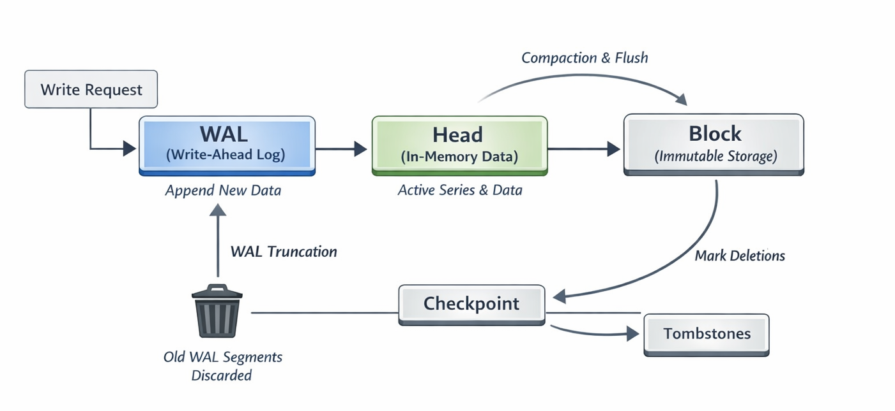

# 1. Overview

Prometheus TSDB는 append-only 구조를 기반으로 동작하며, 
수집된 데이터는 **WAL(Write-Ahead Log) -> Head -> Block** 흐름을 따라 저장된다. 

Prometheus는 데이터를 메모리(Head block)에 저장하는 In-Memory 기반 구조를 사용하기 때문에 
빠른 쓰기 성능을 제공하지만, 장애 발생 시 데이터가 유실될 수 있는 휘발성을 가진다. 
이를 보완하기 위해 모든 쓰기 요청은 먼저 WAL에 순차적으로 기록되며, 
이 WAL은 시스템 장애 이후에도 메모리 상태를 복구하기 위한 용도로 사용된다.
(Prometheus에서의 WAL은 일반적인 읽기나 쓰기 연산에 직접 관여하지 않고, 
오직 장애 복구 및 재시작 시 in-memory 상태를 복원하기 위한 로그로만 활용된다.)

쓰기 요청이 발생하면 데이터는 먼저 WAL에 순차적으로 기록되고, 이후 메모리 상의 Head block에 반영된다. 
일정 시간이 지나면 Head에 존재하던 데이터는 디스크의 Block으로 압축 및 저장되며, 
이 과정에서 **불필요한 WAL 데이터**는 **checkpointing**과 **truncation**을 통해 정리된다. 

또한 삭제 요청은 즉시 반영되지 않고 **tombstone** 형태로 기록되어, 
추후 compaction 과정에서 실제 삭제가 수행된다. 

이와 같은 구조를 통해 Prometheus는 append-only 환경에서의 효율적인 쓰기, 
삭제 처리, 그리고 로그 관리가 가능하도록 설계되어 있다.
---
# 2. Write-Ahead Log (WAL)
## 2.1 Definition
Write-Ahead Logging(WAL)은 데이터베이스 시스템에서 원자성(Atomicity)과 내구성(Durability)(ACID 특성 중 두 가지)을 보장하기 위해 사용되는 로그 기반 기법이다.  
이 방식은 실제 데이터가 수정되기 전에, 해당 변경 사항을 먼저 로그에 기록하는 것을 원칙으로 한다.

즉, 데이터베이스는 디스크의 데이터 페이지를 직접 수정하기에 앞서,  
“어떤 변경이 수행될 것인지”에 대한 정보를 append-only 형태의 로그로 저장한다.  
이를 통해, 시스템 장애 발생 시 로그를 기반으로 데이터 상태를 복구할 수 있다.

Write-Ahead Log의 주요 기능은 다음과 같다.
- **버퍼링과 지속성 보장**: 데이터베이스는 성능 향상을 위해 디스크 데이터 페이지를 메모리(Page Cache)에서 먼저 수정한다.
  이때 WAL은 변경 사항을 로그에 먼저 기록함으로써, 실제 데이터 페이지에 반영되기 전에도 내구성(Durability)을 보장한다.
- **로그 선행 원칙 (Write-Ahead Rule)**: 데이터베이스 상태를 변경하는 모든 연산은
해당 데이터 페이지가 수정되기 전에 반드시 로그에 먼저 기록되어야 한다.
- **디스크 동기화 전까지 로그 유지**: 메모리에서 수정된 데이터가 디스크에 완전히 반영되기 전까지,
해당 연산 기록은 로그에 안전하게 저장되어 유지된다.
- **장애 복구 지원** : 시스템 장애 발생 시, 메모리에만 존재하던 변경 사항은 손실될 수 있다.
WAL은 디스크에 기록된 로그를 기반으로
손실된 변경 사항을 redo하거나 undo할 수 있게 한다.

WAL을 사용하는 시스템에서는 일반적으로 다음 정보가 로그에 저장된다. 
- **Redo(재실행)**: 로그에는 완료되었다고 적혀있으나 실제 데이터에 반영 안 된 작업을 마무리함.
- **Undo(취소)**: 시작만 하고 완료되지 않은 작업을 되돌림.

다른 방식과의 비교 및 활용
- In-place Update: WAL은 데이터를 원래 위치에서 직접 수정할 수 있게 해준다. 덕분에 인덱스나 블록 리스트를 복잡하게 수정할 필요가 줄어든다. (반대 개념으로는 데이터를 다른 곳에 새로 쓰는 Shadow Paging이 있다.)
- 파일 시스템에서의 활용: 현대의 파일 시스템(NTFS, ext4 등)에서도 메타데이터를 보호하기 위해 이와 유사한 기법을 사용하는데, 이를 **저널링(Journaling)** 이라고 한다.

그러나 Prometheus에서는 Undo 대신 Redo 기반 복구만 수행한다.

## 2.2 Role in Prometheus
Prometheus에서 WAL은 일반적인 데이터베이스의 트랜잭션 로그와 달리, 
읽기나 쓰기 경로에 직접 관여하지 않고 오직 복구를 위한 목적으로 사용된다.

Prometheus TSDB는 **메모리 기반의 Head block**에 최신 데이터를 저장하는 구조를 가지며, 
이로 인해 높은 쓰기 성능을 제공하지만 시스템 장애 발생 시 데이터가 유실될 수 있다.  
이를 보완하기 위해 모든 쓰기 요청은 **먼저 WAL에 순차적으로 기록**된 후, 
Head block에 반영된다.

이때 WAL에는 단순한 로그가 아니라, Series, Samples, Tombstones와 같은 구조화된 record가 저장된다.  
- **Series record**: metric과 label로 정의되는 시계열의 식별 정보를 포함하며, 
해당 시계열에 대해 고유한 reference ID를 생성한다.  
- **Samples record**: 이 reference를 기반으로 timestamp와 value를 기록하여, 
label 정보를 반복하지 않고도 데이터를 효율적으로 저장할 수 있다.  
- **Tombstone record**: 삭제 요청의 경우 기록되며, 실제 삭제는 이후 compaction 과정에서 수행된다.

이렇게 **Series와 Samples를 분리**함으로써 문자열 기반 label을 반복 저장하지 않고, 
숫자 기반 reference를 활용하여 디스크 사용량과 메모리 접근 비용을 줄일 수 있다. 또한 WAL replay 시에도 reference 기반으로 빠르게 시계열을 복원할 수 있다.

### Writing them

Series record는 해당 시계열이 처음 등장할 때 한 번만 기록되며,  
Samples record는 sample이 포함된 모든 write 요청에서 기록된다.

만약 write 요청에 새로운 series가 포함된 경우,  
replay 시 reference가 가리킬 대상이 필요하기 때문에  
반드시 **Series record가 먼저 기록된 후 Samples record가 기록되어야 한다.**

- Series record → Head에서 series 생성 이후 기록 (reference 포함)
- Samples record → sample을 Head에 추가하기 전에 기록  
  ```
  ┌────────────┬───────────────────┐
  │ Type       │ WAL 기록 시점       │
  ├────────────┼───────────────────┤
  │ Series     │ 생성 후             │
  │ Samples    │ 추가 전             │
  └────────────┴───────────────────┘
  ```

또한 하나의 write 요청은 다음과 같이 처리된다.

- 기본적으로 **Series record 1개 + Samples record 1개 생성**
- 이미 모든 series가 존재하는 경우 → **Samples record만 기록**

삭제 요청의 경우:
- 즉시 삭제하지 않고 Tombstone을 생성
- Tombstone record를 WAL에 먼저 기록한 후 삭제 처리 수행

### WAL의 디스크 저장 포맷
Prometheus는 로그를 하나의 거대한 파일이 아닌, 여러 개의 세그먼트 파일로 나누어 관리한다. 
```
data
└── wal
    ├── 000000
    ├── 000001
    └── 000002
```
파일 이름은 `000000`, `000001`처럼 6자리 숫자로 된 순차적인 번호를 사용하며, 기본적으로 파일당 128MB로 제한된다. 
각 세그먼트는 32KB 크기의 페이지들로 구성된다. 

**Record Fragment 구조**
 
```
┌───────────┬──────────┬────────────┬──────────────┐
│ type <1b> │ len <2b> │ CRC32 <4b> │ data <bytes> │
└───────────┴──────────┴────────────┴──────────────┘
```
하나의 record는 페이지 크기를 초과할 경우 여러 fragment로 나뉘어 저장되며, 
각 fragment에는 record의 시작/중간/끝을 구분하는 type 정보와 길이, checksum, data가 포함된다.

**Record Types**
- **Series Records**  
  특정 Series를 식별하는 labels과 고유 ID를 저장한다. 
  ```
  ┌────────────────────────────────────────────┐
  │ type = 1 <1b>                              │
  ├────────────────────────────────────────────┤
  │ ┌─────────┬──────────────────────────────┐ │
  │ │ id <8b> │ n = len(labels) <uvarint>    │ │
  │ ├─────────┴────────────┬─────────────────┤ │
  │ │ len(str_1) <uvarint> │ str_1 <bytes>   │ │
  │ ├──────────────────────┴─────────────────┤ │
  │ │  ...                                   │ │
  │ ├───────────────────────┬────────────────┤ │
  │ │ len(str_2n) <uvarint> │ str_2n <bytes> │ │
  │ └───────────────────────┴────────────────┘ │
  │                  . . .                     │
  └────────────────────────────────────────────┘
  ```

- Sample Records  
실제 수치 데이터를 저장하며, 메모리 절약을 위해 **델타 인코딩(Delta Encoding)** 을 사용한다.
첫 번째 sample의 ID와 타임스탬프를 기준으로, 이후 데이터들은 그 차이값(Delta)만 저장하여 바이트 수를 줄인다.
  ```
  ┌──────────────────────────────────────────────────────────────────┐
  │ type = 2 <1b>                                                    │
  ├──────────────────────────────────────────────────────────────────┤
  │ ┌────────────────────┬───────────────────────────┐               │
  │ │ id <8b>            │ timestamp <8b>            │               │
  │ └────────────────────┴───────────────────────────┘               │
  │ ┌────────────────────┬───────────────────────────┬─────────────┐ │
  │ │ id_delta <uvarint> │ timestamp_delta <uvarint> │ value <8b>  │ │
  │ └────────────────────┴───────────────────────────┴─────────────┘ │
  │                              . . .                               │
  └──────────────────────────────────────────────────────────────────┘
  ```
  
- Tombstone Records  
  데이터 삭제 기록이며, "어느 ID의 어느 시간대 데이터를 삭제했다"라는 정보를 담고 있다.
  ```
  ┌─────────────────────────────────────────────────────┐
  │ type = 3 <1b>                                       │
  ├─────────────────────────────────────────────────────┤
  │ ┌─────────┬───────────────────┬───────────────────┐ │
  │ │ id <8b> │ min_time <varint> │ max_time <varint> │ │
  │ └─────────┴───────────────────┴───────────────────┘ │
  │                        . . .                        │
  └─────────────────────────────────────────────────────┘
  ```

결과적으로 Prometheus의 WAL은 단순한 로그를 넘어, 시계열 데이터 구조에 최적화된 저장 형식과 reference 기반 인덱싱을 통해 
효율적인 기록, 빠른 복구, 그리고 안정적인 데이터 관리를 동시에 지원하는 역할을 수행한다.

---
# 3. Durability
## 3.1 Definition

 ACID는 트랜잭션을 정의하는 4가지 중대한 속성을 가리키는 약어이다. 즉 원자성(Atomicity), 일관성(Consistency), 신뢰성(Reliability), 격리(Isolation) 그리고 영속성(Durability)을 의미한다. ACID 트랜잭션은 한 테이블의 읽기, 쓰기 또는 수정 작업이 각각 다음과 같은 속성을 가지고 있다고 보장해준다.
- **원자성(Atomicity)**  
  트랜잭션에 속한 각각의 문(데이터를 읽기, 쓰기, 업데이트 또는 삭제하기 위함)을 하나의 단위로 취급합니다. 문 전체를 실행하거나 그 문의 어떤 부분도 실행하지 않거나 둘 중 하나이다. 이 속성이 있으면 예컨대 스트리밍 데이터 소스가 스트리밍 중에 갑자기 오류를 일으키더라도 데이터 손실과 손상이 방지된다.
- **일관성(Consistency)**  
트랜잭션이 테이블에 변경 사항을 적용할 때 미리 정의된, 예측할 수 있는 방식만 취한다. 트랜잭션 일관성이 확보되면 데이터 손상이나 오류 때문에 테이블 무결성에 의도치 않은 결과가 생기지 않는다.
- **격리(Isolation)**  
여러 사용자가 같은 테이블에서 모두 동시에 읽고 쓰기 작업을 할 때, 각각의 트랜잭션을 격리하면 동시 트랜잭션이 서로 방해하거나 영향을 미치지 않는다. 각각의 요청이 실제로는 모두 동시에 발생하더라도, 마치 하나씩 발생하는 것처럼 발생할 수 있다.
- **영속성(Durability)**  
트랜잭션 실행으로 인해 데이터에 적용된 변경 사항이 저장되도록 보장한다. 시스템 오류가 발생해도 마찬가지이다.


## 3.2 How WAL Ensures Durability in Prometheus
시스템이 재시작되면 Prometheus는 WAL을 replay하여 기록된 Series, Samples, Tombstones record를 다시 읽고, 이를 기반으로 메모리 상의 Head 상태를 복원한다.

이 과정에서 WAL은 실제 데이터 저장소가 아니라,Head 상태를 재구성하기 위한 redo 로그로 동작한다.즉, WAL에 기록된 변경 사항을 순서대로 다시 적용함으로써 장애 이전의 상태를 복구할 수 있다.

결과적으로 Prometheus는 "메모리에서 빠르게 처리 + WAL을 통한 디스크 기록"이라는 구조를 통해 
성능과 Durability를 동시에 확보한다.

---
# 4. Tombstone

## 4.1 Definition
Tombstone은 삭제 요청을 즉시 반영하지 않고,삭제할 시계열과 시간 범위를 기록해 두는 방식이다.


## 4.2 Role in Prometheus
Prometheus는 append-only 구조를 기반으로 동작하기 때문에, 
이미 기록된 데이터를 즉시 수정하거나 삭제하는 것이 어렵고 비효율적이다.

따라서 Prometheus에서는 특정 시계열의 데이터를 삭제할 때, 
해당 데이터를 즉시 메모리나 디스크에서 제거하지 않고 
삭제 대상(series reference)과 삭제할 시간 범위(min_time, max_time)를
Tombstone record 형태로 저장한다. 

이후 compaction과정(블록 갱신)에서 실제 데이터를 제거한다.

이 과정에서 Tombstone record는 WAL에 먼저 기록되며, 
시스템 재시작 시에도 동일하게 적용되어 삭제 상태가 유지된다.

# 5. Checkpointing
## 5.1 Definition
Checkpointing은 WAL을 truncate하기 전에, 
삭제될 WAL segment들로부터 checkpoint를 생성하여 필요한 record만을 선별하는 과정이다.

즉, checkpoint는 현재 Head 상태를 기준으로 불필요한 데이터를 제거한 "filtered WAL" 형태의 로그이다.

이를 통해 WAL의 크기를 줄이면서도, 시스템 재시작 시 필요한 최소한의 정보만 유지할 수 있다.

## 5.2 Role in Prometheus
Prometheus에서 WAL은 지속적으로 증가하기 때문에, 
주기적으로 오래된 segment를 삭제(truncation)해야 한다.  

그러나 단순히 WAL을 삭제할 경우 다음과 같은 문제가 발생한다.

- Series record는 한 번만 기록되기 때문에, 삭제 시 reference가 깨질 수 있음
- 아직 Head에 남아 있는 sample이 삭제된 WAL segment에 존재할 수 있음

이러한 문제를 해결하기 위해 Prometheus는 WAL truncation 이전에 checkpoint를 생성한다.

예를 들어 다음과 같은 WAL 구조가 있다고 가정하자.

```
data
└── wal
├── 000000
├── 000001
├── 000002
├── 000003
├── 000004
└── 000005
```

Head truncation 기준 시간을 T라고 할 때,  
삭제 대상이 되는 `000000 ~ 000003` segment를 순차적으로 읽으면서 checkpoint를 생성한다.

이 과정에서 다음과 같은 필터링이 수행된다.

- Head에 존재하지 않는 series 제거
- 기준 시간 T 이전의 sample 제거
- 기준 시간 T 이전의 tombstone 제거
- 나머지 record는 WAL의 순서를 유지한 채 보존

이렇게 생성된 checkpoint는 다음과 같은 형태로 저장된다.
```
data
└── wal
├── checkpoint.000003
│ ├── 000000
│ └── 000001
├── 000004
└── 000005
```

Checkpoint는 WAL과 동일한 형식으로 저장되며, 시스템 재시작 시 WAL replay의 시작점으로 사용된다.
(checkpoint.X에서 X는 어디까지 WAL이 반영되었는지를 의미하여, 그 다음 WAL은 X+1부터 replay된다.)


결과적으로 checkpointing은 WAL을 안전하게 정리하면서도 series reference와 Head에 남아 있는 데이터를 유지하여 
데이터 손실 없이 빠른 복구를 가능하게 한다.

# 6. Reference
https://ganeshvernekar.com/blog/prometheus-tsdb-wal-and-checkpoint/
https://en.wikipedia.org/wiki/Write-ahead_logging
https://github.com/prometheus/prometheus/blob/main/tsdb/docs/format/wal.md
https://www.databricks.com/kr/blog/what-are-acid-transactions
