# Prometheus TSDB - Memory Mapping of Head Chunks 실습

## 환경 세팅

**실습 환경**
* 로컬 맥북, Docker

**docker-compose.yml에서의 Prometheus 설정값**
* '--storage.tsdb.min-block-duration=10m'
* '--storage.tsdb.max-block-duration=10m'
    * 관찰을 위해 persistent block의 크기를 10분으로 설정했다. (chunkRange가 10분)
* scrape_interval: 1s
    * scrape_interval을 1초로 설정했다. 1초마다 샘플을 수집하기 때문에 120 샘플을 수집하는데 2분이 걸린다. 즉 chunk가 다 차는데 2분이 걸린다.

> Once the chunk fills till 120 samples (or) spans upto chunk/block range (let's call it chunkRange), which is 2h by default, a new chunk is cut and the old chunk is said to be "full".

```bash
docker compose up -d
```

접속 확인:
- Prometheus: http://localhost:9090
- Grafana: http://localhost:3000 (admin / admin)

---

## 실습 1. chunks_head 디렉토리 구조 관찰

1. /prometheus 디렉토리 확인

```bash
docker exec prometheus ls -la /prometheus/
```
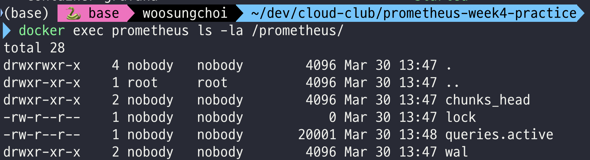

chunks_head/ 폴더가 바로 생성되었다.

2. /prometheus/chunks_head 디렉토리 확인

```bash
docker exec prometheus ls -la /prometheus/chunks_head/
```
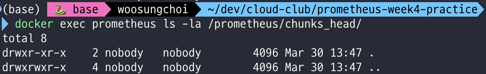

chunks_head에 아무 파일도 없다. 아직 가득 찬 chunk가 없어 mmap을 할 chunk가 없는 상황이다. 2분 후 다시 확인한다.

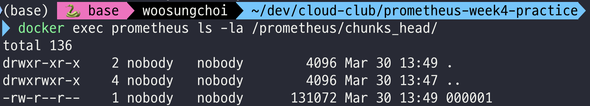

2분 후 ```000001```이 생겼다.

---

## 실습 2. chunks_head 파일 바이너리 분석

chunks_head 파일이 생성되면 magic number와 헤더를 직접 확인한다.

```bash
# 파일 첫 32바이트를 16진수로 출력
docker exec prometheus sh -c "xxd /prometheus/chunks_head/000001 | head -5"
```

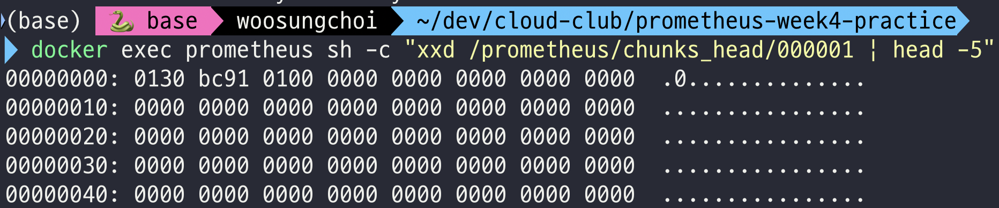

아직 page cache에서 디스크로 flush 되지 않아서 데이터가 쓰이지 않았다. 10분 후 다시 확인한다.

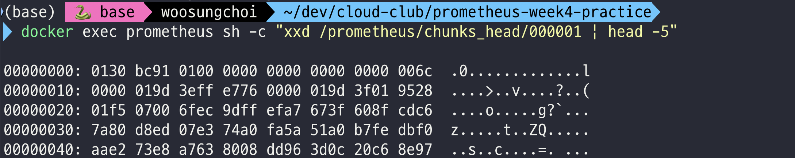


**확인 포인트**:
- 첫 4바이트: `01 30 bc 91` → magic number (0x0130BC91, Ganesh Vernekar의 생일 19971217)
- 5번째 바이트: `01` → version
- 6~8번째 바이트: `00 00 00` → padding
- 9번째 바이트부터: 첫 번째 chunk 시작

---

## 실습 3. Python으로 청크 파싱

chunks_head 파일을 로컬로 복사한 뒤 Python으로 파싱한다.

```bash
# 컨테이너에서 로컬로 파일 복사
docker cp prometheus:/prometheus/chunks_head/000001 ./chunks_head_000001
```

그 다음 `parse_chunks.py`를 실행한다:

```bash
python3 parse_chunks.py
```

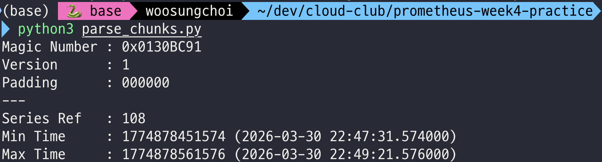

**결과**: 첫번째 청크의 series_ref 값이 108이었고, mint와 maxt에 2분정도의 차이가 있었다. 예상대로 chunk가 다 차는데 2분정도 걸린다는 것을 알 수 있다.

---

## 실습 4. chunk_ref(Reference) 계산해보기

블로그에서 설명한 참조 인코딩 방식: `(파일번호 << 32) | 오프셋`

파일번호 1, 오프셋 8(헤더 직후)이라면 참조값은 아래와 같다.

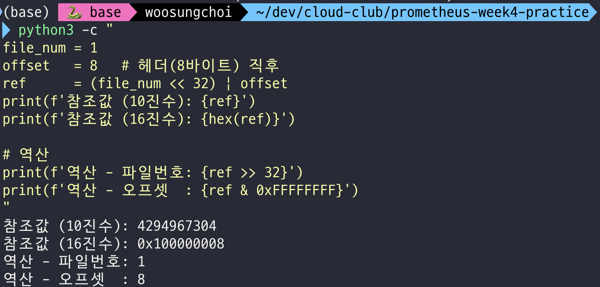

메모리상에 series ref 108에 대한 첫 chunk_ref이 위와 같을 것이다.

---

## 실습 5. Grafana로 관찰

Grafana(`http://localhost:3000`)에서 아래 쿼리로 대시보드를 만든다.

**패널 1 - Head의 총 청크 수**
```
prometheus_tsdb_head_chunks
```

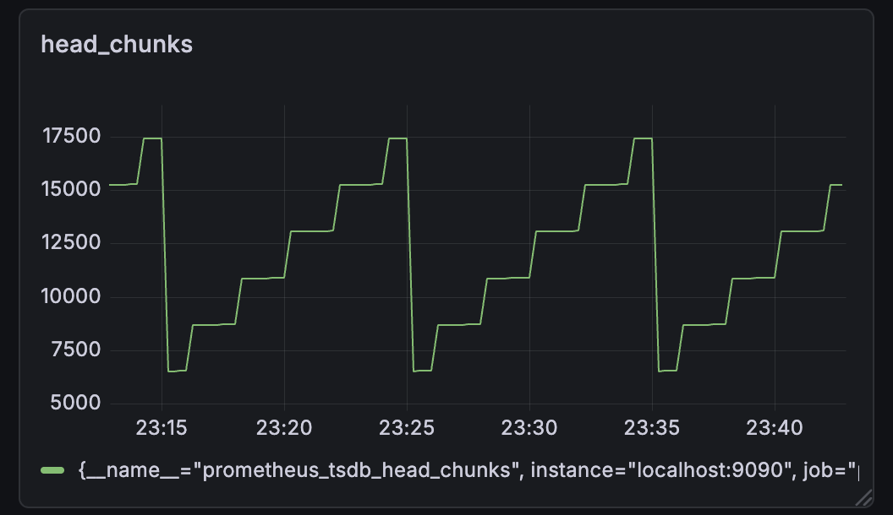

* 2분주기로 각 series에 대한 chunk가 동시에 차면서 head_chunks의 수가 약 2000개씩 올라간다.

* **설명**
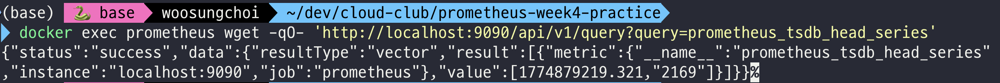
series의 수가 2169이기 때문에 2분마다 chunk 수가 약 2000씩 올라가야 한다.

* 약 6000개에서 5계단을 올라가 17500을 찍고 다시 6000근방으로 떨어지는 패턴을 볼 수 있다.

* **설명**
compaction은 head에 쌓인 청크가 chunkRange*(3/2) 에 도달하면 발생한다. 현재 chunkRange의 1.5배는 15분이다. chunk가 8번 차면 16분어치의 chunk가 쌓이고 compaction이 일어난다. 이 때, compaction 대상은 chunkRange(10분) 만큼의 chunk고 6분 어치의 chunk(3묶음, 약 6000개)는 Head에 남는다.

> When the data in the Head spans chunkRange*3/2, the first chunkRange of data (2h here) is compacted into a persistent block.

**패널 2 - chunks_head 파일 크기**
```
prometheus_tsdb_head_chunks_storage_size_bytes
```
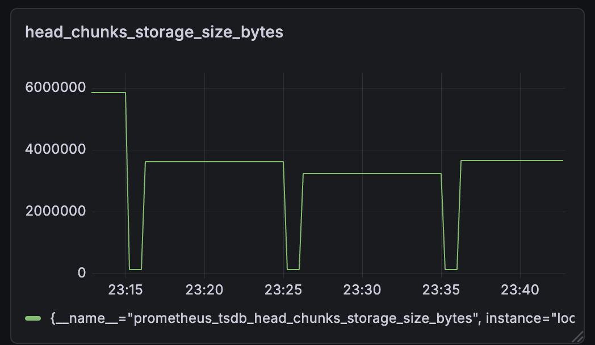

* 10분 주기로 truncation이 일어나는 모습을 확인할 수 있다.

* 000001, 000002가 삭제된 모습
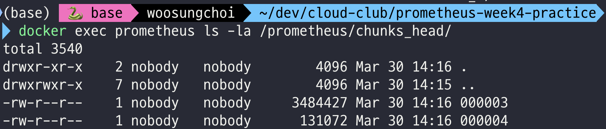

**패널 3 - Prometheus RSS 메모리**
```
process_resident_memory_bytes{job="prometheus"}
```

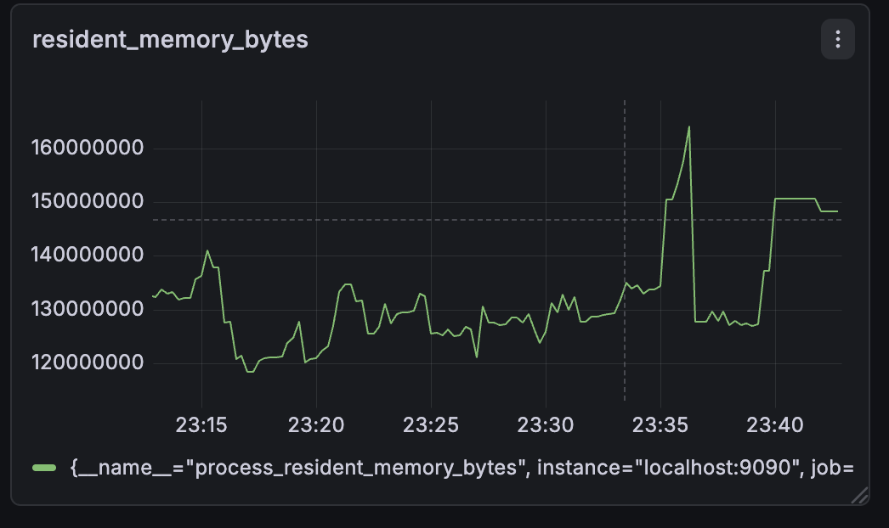

* 다 찬 chunk는 mmap 시키기 때문에, chunk가 늘어나더라도 메모리 사용량이 비례해서 늘지 않는다.

---

## 실습 6. 로그 관찰

compaction, truncation, checkpoint 로그를 관찰한다.

```bash
docker compose logs -f prometheus | grep -E "truncat|compac|checkpoint|gc"
```
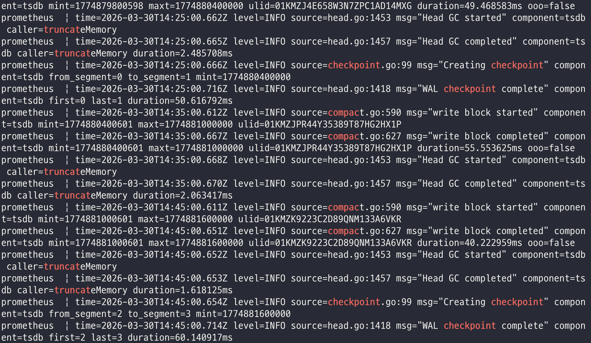

* 10분 주기로 ```Compaction -> Head truncation -> Cheakpoint 생성``` 순서로 발생한다.