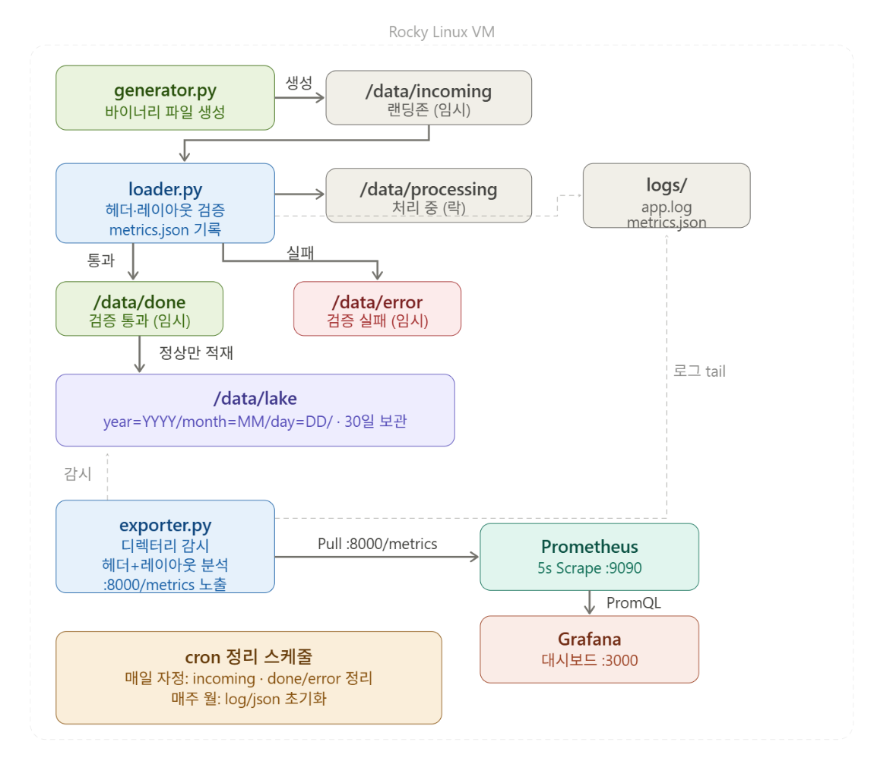

# TSDB 1주차 실습



## generator.py : /data/incoming 디렉터리에 랜덤한 파일을 생성합니다.

```
def make_file(filename, record_count, corrupt=False, wrong_version=False,
              wrong_checksum=False, size_mismatch=False, partial_body=False)
```
[ 헤더 영역 - 14바이트 ]

00-03: 44 41 54 31         (Magic: "DAT1")

04-05: 00 02               (Version: 2)

06-09: 00 00 00 02         (Count: 2)

0A-0D: XX XX XX XX         (Checksum: 바디 합계)

#### corrupt (Magic Number Error)
"파일의 형식 식별"
파일의 시작 바이트(Magic Byte)를 해당 시스템의 파일형식 (DAT1) 이 아닌 XXXX 로 작성합니다.
파일의 형식을 식별 실패 테스트가 목적으로 다른 형식의 파일이 수집되었음을 확인합니다.
```
magic    = b'XXXX' if corrupt else MAGIC
```

#### wrong_version(버전의 불일치)
"버전 식별"
버전 번호를 정상인 2번이 아닌 9번으로 기록합니다.
데이터 포맷 스키마가 변경되었을시에 처리할수 없는 버전의 데이터가 들어옴을 식별합니다.
```
version  = 9 if wrong_version else VERSION
```
#### wrong_checksum(체크섬 확인)
"데이터의 변조/오염 식별"
실제 데이터(Body)의 합계와 헤더에 기록된 checksum 값을 다르게 만듭니다. (정상 값에 +1 오프셋)
```
if wrong_checksum:
checksum = (checksum + 1) % (2**32) 
```
파일 크기나 이름은 정상이지만, 내부 비트가 튀었을 때 이를 식별합니다.

#### size_mismatch=True(레이아웃 정의 실패)
"프로세스 강제 종료로 인한 쓰기 중단"
예를 들어 헤더에는 레코드가 1,000개 있다고 적어놓고, 실제 데이터는 999개만 기록합니다.
로직 일관성 체크. 파서가 헤더 정보를 믿고 읽다가 파일의 끝(EOF)을 너무 빨리 만났을 때,  런타임 에러로 죽지 않고 예외 처리를 하는지 테스트합니다.
```
if size_mismatch:
        # 헤더에는 record_count 기록, body는 1개 적게 작성 
        body = struct.pack(f'>{record_count - 1}q', *records[:-1])
```

#### partial_body=True (불완전한 레코드)
"잘못된 패딩(Padding) 또는 데이터 유입 오류"
8바이트 단위로 딱 떨어져야 하는 Body 뒤에 의미 없는 3바이트(\xff\xff\xff)를 추가합니다.

```
  elif partial_body:
        # body 뒤에 3바이트 추가 → body_size % 8 != 0 → layout_partial_fail
        body = body + b'\xff\xff\xff'
```
## loader.py : 파일을 검증한 후 알맞은 디렉터리에 적재합니다.

/data/incoming -> /data/processing(파일 검증을 하기위해 검증 디렉터리에 적재)

/data/processing -> /data/done (파일이 문제가 없는 파일일 경우)

/data/processing -> /data/error (파일에 문제가 있을 경우)

/data/done -> /data/lake/YYYY/MM/DD (검증된 파일 보관)


## exporter.py : 매트릭 수집하는 커스텀 Exporter 입니다.

### 노출 매트릭 정의
```
dir_file_count   = Gauge('dir_file_count',    '디렉터리 파일 수',   ['path'])
dir_bytes_total  = Gauge('dir_bytes_total',   '디렉터리 총 크기',   ['path'])
log_lines        = Counter('log_lines_total', '로그 라인 수',       ['level'])
partition_exists     = Gauge('partition_exists',       '파티션 존재 여부',   ['date'])
partition_file_count = Gauge('partition_file_count',   '파티션 파일 수',     ['date'])
partition_bytes      = Gauge('partition_bytes',        '파티션 총 크기',     ['date'])


ldr_magic_ok             = Gauge('loader_magic_ok_total',             '헤더 정상 파일 수 누계')
ldr_magic_fail           = Gauge('loader_magic_fail_total',           '헤더 손상 파일 수 누계')
ldr_layout_ok            = Gauge('loader_layout_ok_total',            '레이아웃 검증 통과 파일 수 누계')
ldr_layout_fail          = Gauge('loader_layout_fail_total',          '크기 불일치 파일 수 누계')
ldr_layout_partial_fail  = Gauge('loader_layout_partial_fail_total',  '잔여 바이트 파일 수 누계')
ldr_checksum_fail        = Gauge('loader_checksum_fail_total',        '체크섬 불일치 파일 수 누계')
ldr_ver_fail             = Gauge('loader_version_fail_total',         '버전 불일치 파일 수 누계')
ldr_records              = Gauge('loader_total_records',              '처리한 총 레코드 수 누계')
```


### counter 와 gauge
Counter는 값이 0부터 시작해서 계속 늘어나기만 하는 누적 메트릭

Gauge는 현재의 상태를 나타내는 수치

