# Week 2 — The Head Block: 커널 파라미터 튜닝 실습

## 실습 환경 구성

- 도커가 설치된 환경입니다.
- Oracle Cloud ubuntu instance에서 진행하였습니다.

```bash
mkdir prometheus
cd prometheus/
```

프로젝트 폴더를 위와 같이 만들어준 뒤 이동

```bash
vi docker-compose.yml
```

```yaml
services:
  prometheus:
    image: prom/prometheus:latest
    container_name: prometheus
    ports:
      - "9090:9090"
    volumes:
      - ./config/prometheus.yml:/etc/prometheus/prometheus.yml
      - ./data/prometheus:/prometheus
    command:
      - '--config.file=/etc/prometheus/prometheus.yml'
      - '--storage.tsdb.path=/prometheus'
      - '--storage.tsdb.retention.time=7d'
      - '--web.enable-lifecycle'
    restart: unless-stopped

  node-exporter:
    image: prom/node-exporter:latest
    container_name: node_exporter
    ports:
      - "9100:9100"
    volumes:
      - /proc:/host/proc:ro
      - /sys:/host/sys:ro
      - /:/rootfs:ro
    command:
      - '--path.procfs=/host/proc'
      - '--path.sysfs=/host/sys'
      - '--path.rootfs=/rootfs'
    restart: unless-stopped

  avalanche:
    image: quay.io/prometheuscommunity/avalanche:latest
    container_name: avalanche
    ports:
      - "9001:9001"
    command:
      - '--gauge-metric-count=500'
      - '--series-count=20'
      - '--series-interval=60'
      - '--port=9001'
    restart: unless-stopped
```

docker-compose 파일 만들어준 뒤 컨테이너 3개를 구성합니다.

### 각 컨테이너의 목적

### a. Prometheus

메트릭 수집 및 TSDB 저장소 역할을 담당합니다.

avalanche가 생성한 가짜 메트릭과 node_exporter의 OS 메트릭을 15초마다 수집하여 Head Block에 적재합니다.

데이터는 `./data/prometheus` 경로에 영속화되며, 이 디렉토리에서 Fabian 블로그에서 배운 블록 분할 구조(`wal/`, `chunks/`, `index`, `meta.json`)를 직접 확인할 수 있습니다.

### b. node_exporter

OS 레벨의 메트릭을 수집하는 역할을 합니다. (즉, 실험 별 비교할 수치를 뽑아내는 용도)

`/proc`, `/sys` 디렉토리를 볼륨 마운트로 연결하여 호스트 VM의 실제 메모리, 디스크 I/O 상태를 읽어옵니다.

본 실험의 핵심 측정 대상인 `node_memory_Dirty_bytes`와 `node_disk_written_bytes_total`이 이 컨테이너를 통해 수집됩니다.

### c. avalanche

Prometheus용 **부하 생성 도구**입니다. 실제 서버 없이도 대량의 가짜 시계열 메트릭을 만들어내어 Prometheus가 지속적으로 데이터를 수집하고 저장하도록 유도합니다.

`--gauge-metric-count=500`, `--series-count=20` 설정으로 총 **10,000개의 시계열**을 생성하며, Series Churn(시계열 변동) 상황을 `--series-interval` 옵션으로 시뮬레이션할 수 있습니다.

### 도커 컨테이너 확인

```bash
docker compose up -d
docker ps
```

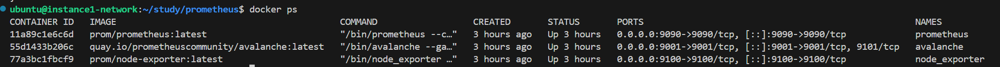

```bash
curl -s "http://localhost:9090/api/v1/query?query=up" | python3 -m json.tool
```

```json
{
    "status": "success",
    "data": {
        "resultType": "vector",
        "result": [
            {
                "metric": {
                    "__name__": "up",
                    "instance": "node_exporter:9100",
                    "job": "node"
                },
                "value": [1773759969.265, "1"]
            },
            {
                "metric": {
                    "__name__": "up",
                    "instance": "avalanche:9001",
                    "job": "avalanche"
                },
                "value": [1773759969.265, "1"]
            },
            {
                "metric": {
                    "__name__": "up",
                    "instance": "localhost:9090",
                    "job": "prometheus"
                },
                "value": [1773759969.265, "1"]
            }
        ]
    }
}
```

---

## 커널 파라미터 변수 설정 — 튜닝 대상

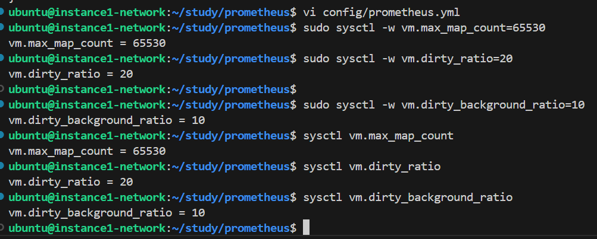

```bash
# Baseline을 일반 Linux 기본값으로 설정
sudo sysctl -w vm.max_map_count=65530
sudo sysctl -w vm.dirty_ratio=20
sudo sysctl -w vm.dirty_background_ratio=10

# 설정 확인
sysctl vm.max_map_count
sysctl vm.dirty_ratio
sysctl vm.dirty_background_ratio
```

이 세 가지 변수는 애플리케이션(예: Prometheus, Elasticsearch 등)이 운영체제의 메모리를 얼마나, 그리고 어떻게 활용할지 제어합니다.

### 1. `vm.max_map_count` (기본값: 65530)

- **의미:** 단일 프로세스가 가질 수 있는 **가상 메모리 맵 영역(Memory Mapped Areas)의 최대 개수**를 제한합니다.
- **기술적 배경 (`mmap`과 연관):** Prometheus V3는 `mmap` 시스템 콜을 통해 디스크의 파일 내용을 메모리 주소에 직접 매핑하여 성능을 높입니다. 파일의 특정 부분을 메모리에 매핑할 때마다 운영체제는 맵 영역을 하나씩 할당합니다.
- **실무적 의미:** Prometheus나 Elasticsearch처럼 `mmap`을 활용하는 데이터베이스 엔진들은 수많은 파일을 메모리에 조각조각 매핑합니다. 만약 이 설정값이 기본값(65530)으로 너무 낮게 설정되어 있다면, 운영체제는 더 이상 메모리 매핑을 허용하지 않고 에러를 발생시킵니다.
- *추후 실험에서 다뤄볼 예정입니다.*

### 2. Dirty Page의 이해

나머지 두 변수를 이해하려면 먼저 'dirty page'의 개념을 알아야 합니다.

애플리케이션이 데이터를 수정할 때, OS는 매번 디스크에 직접 쓰지 않고 성능을 위해 우선 메모리(RAM)에만 변경 사항을 기록해 둡니다.

이렇게 '메모리에는 쓰였지만, 아직 물리적 디스크에는 동기화(저장)되지 않은 변경된 메모리 공간'을 dirty page라고 부릅니다.

### 3. `vm.dirty_background_ratio` (기본값: 10)

- **의미:** 전체 시스템 메모리 대비 더티 페이지가 차지하는 비율이 10%에 도달하면, **백그라운드에서 디스크 쓰기(Flush) 작업을 시작**하라는 임계치입니다.
- **작동 원리:** 이 수치에 도달하면 OS 커널의 백그라운드 스레드가 메모리에 쌓인 더티 페이지들을 디스크에 비동기적으로 기록하기 시작합니다. 이때 애플리케이션의 정상적인 읽기/쓰기 작업은 방해받지 않고 그대로 진행됩니다.

### 4. `vm.dirty_ratio` (기본값: 20)

- **의미:** 전체 시스템 메모리 대비 더티 페이지가 차지하는 비율이 20%에 도달했을 때 적용되는 강제 디스크 쓰기 임계치입니다.
- **작동 원리:** 백그라운드 쓰기가 작동 중임에도 불구하고 더티 페이지가 계속 쌓여 결국 20%에 도달한 상황입니다.
- **실무적 의미:** 이 한계치에 도달하면, OS는 모든 애플리케이션 프로세스의 동작을 일시 정지(Block)시키고, 메모리의 데이터를 강제로 디스크에 기록(동기적)합니다. 당연히 시스템에는 I/O로 인한 지연이 발생하게 됩니다.

---

## `vm.dirty_ratio` & `vm.dirty_background_ratio`

이번 실험에서 다룰 두 커널 파라미터를 좀 더 살펴보겠습니다.

```
Dirty Page 비율
0%                    10%                   20%                 100%
│─────────────────────│─────────────────────│───────────────────│
                      ↑                     ↑
            background flush 시작    강제 flush (프로세스 block)
            (조용히 처리)             (쓰기 지연 발생)
```

**`vm.dirty_ratio` (기본값: 20%)**

전체 메모리 대비 Dirty Page가 이 비율을 초과하면, OS가 해당 프로세스를 강제로 멈추고 디스크에 flush합니다.

**`vm.dirty_background_ratio` (기본값: 10%)**

Dirty Page가 이 비율을 초과하면, OS가 **백그라운드에서** flush를 시작합니다. 프로세스는 멈추지 않고 계속 실행됩니다.

즉 background에서 flush되는 정도를 넘어서 dirty page가 계속해서 늘어나게 되면? 자연스레 프로세스를 멈추고 디스크에 flush하게 됩니다.

위 커널 파라미터들은 SSD에서 발생하는 **Write Amplification** 과 직결됩니다.

Dirty Page가 너무 많이 쌓이면 한꺼번에 대량 flush가 발생하고, 이것이 SSD 수명을 단축시키는 원인입니다. (만약 dirty_page 비율이 너무 낮으면 SSD 페이지 단위보다 적게 쌓여도 바로바로 flush를 하니 SSD에 무리가 가게 됩니다.)

반대로 너무 자주 flush하면 쓰기 지연이 증가합니다(디스크 IO는 비용이 비싼 작업이기 때문이죠).

---

## Prometheus 접근

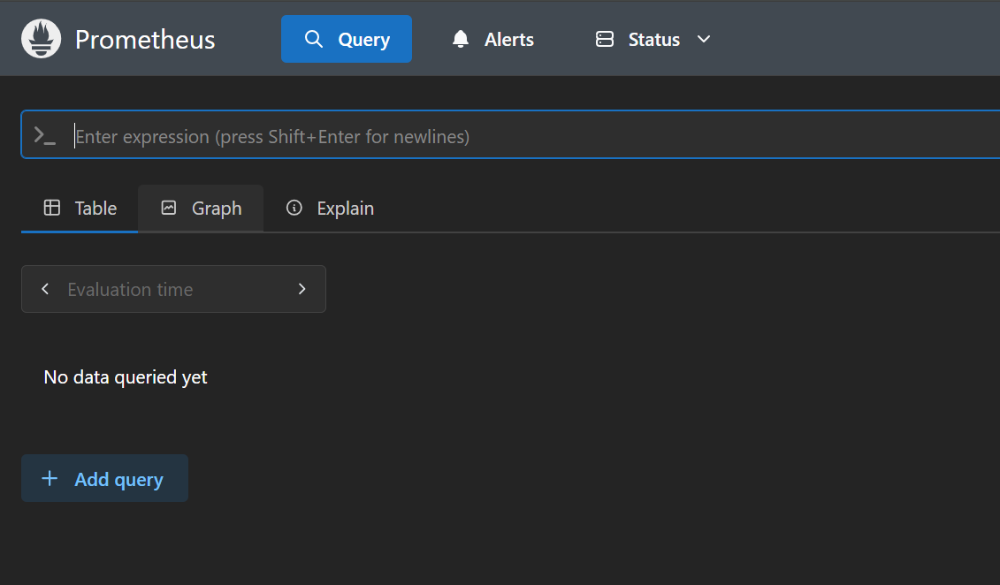

docker로 container가 다 올라갔다면 `http://<IP>:9090` 으로 접근합니다.

잘 뜬다면 더미 데이터(시계열)들이 수집되는 중일테니 이대로 시간을 보내고 진행하시면 됩니다.

(최소 30분 정도의 데이터 적재 시간을 추천드립니다.)

---

## Prometheus — PromQL 질의 준비

10분 정도 시간을 가진 뒤 아래의 PromQL로 질의하여 값을 확인합니다.

```promql
# 현재 메모리에 쌓인 Dirty Page 크기
node_memory_Dirty_bytes

# 초당 디스크 쓰기량 (flush 빈도/양 측정)
rate(node_disk_written_bytes_total[1m])

# 초당 WAL page flush 횟수 (WAL 쓰기 빈도 측정)
rate(prometheus_tsdb_wal_page_flushes_total[1m])

# 초당 WAL 실제 쓰기 바이트 (WAL 쓰기 양 측정)
rate(prometheus_tsdb_wal_record_parts_bytes_written_total[1m])

# 현재 사용 가능한 메모리 크기
node_memory_MemAvailable_bytes
```

---

## Baseline 측정

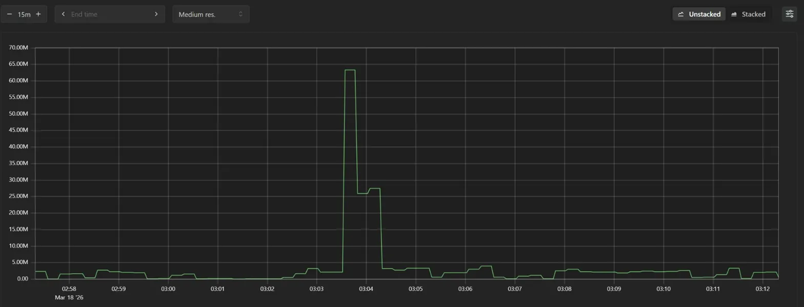

![Baseline — rate(node_disk_written_bytes_total[1m])](./images/baseline_disk_written.png)

![Baseline — rate(prometheus_tsdb_wal_page_flushes_total[1m])](./images/baseline_wal_flushes.png)

![Baseline — rate(prometheus_tsdb_wal_record_parts_bytes_written_total[1m])](./images/baseline_wal_bytes.png)

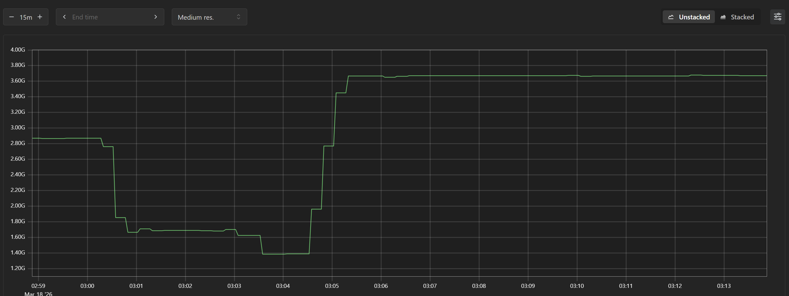

| 메트릭 | Baseline 값 |
| --- | --- |
| Dirty_bytes | 평상시 1\~3M, 스파이크 시 63M |
| disk_written/s | 평상시 0, 스파이크 시 9M |
| WAL flushes/s | 0.33\~0.63 (규칙적) |
| WAL bytes/s | 4k\~12k (규칙적) |
| MemAvailable | 3.6G (안정) |

Dirty_bytes의 경우 Compaction 작업으로 인해
`대량의 IO 작업` → `mmap 활용` → `dirty_page 증가`로 인해 스파이크(솟아 있는 이상치)로 추정됩니다!

당연하게도 disk_written에서 발생한 스파이크 역시 여러 블록을 읽어서 하나의 큰 블록으로 합치며 디스크에 쓰는 작업인 Compaction 작업의 특성으로 발생한 것으로 추정됩니다.

(시간도 비슷한 시점임을 확인할 수 있습니다.)

---

## 실험 A — dirty_ratio=5%

```bash
sudo sysctl -w vm.dirty_ratio=5
sudo sysctl -w vm.dirty_background_ratio=2

sysctl vm.dirty_ratio
sysctl vm.dirty_background_ratio
```

튜닝 방향은 dirty_page를 허용하는 OS의 커널 파라미터를 줄여서 보다 flush(즉 디스크 IO)가 자주 일어나도록 만들고 그래프를 다시 관측 하고자 합니다.

변경 후 5분 정도 기다려줍니다.

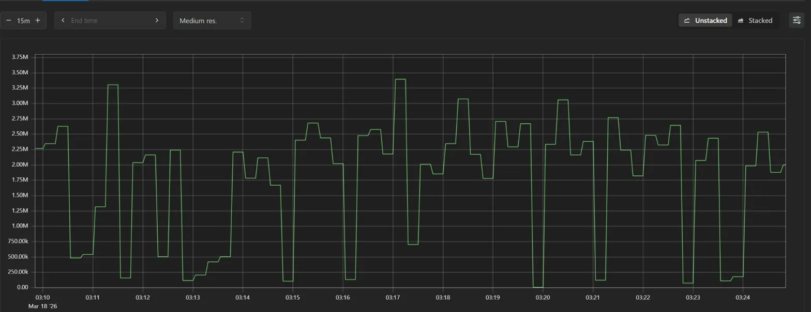

![실험A — rate(node_disk_written_bytes_total[1m])](./images/expA_disk_written.png)

![실험A — rate(prometheus_tsdb_wal_page_flushes_total[1m])](./images/expA_wal_flushes.png)

![실험A — rate(prometheus_tsdb_wal_record_parts_bytes_written_total[1m])](./images/expA_wal_bytes.png)

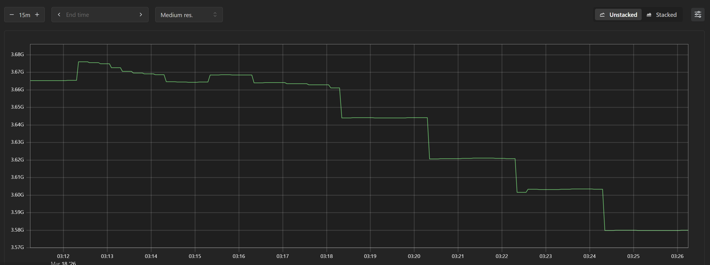

그래프가 많이 변한 것 같지만, 스파이크라는 outlier가 없어져서 그래프가 변동된 상태이므로 보다 면밀히 비교해보아야 합니다!

### 실험 A (dirty_ratio=5%) 결과 분석

| 메트릭 | Baseline (20%) | 실험 A (5%) | 변화 |
| --- | --- | --- | --- |
| Dirty_bytes | 평상시 1\~3M, 스파이크 63M | 지속적 1.5\~3.5M, 스파이크 없음 | 예측과 일치 |
| disk_written/s | 간헐적 스파이크 9M | 지속적 60k\~190k | 예측과 일치 |
| WAL flushes/s | 0.33\~0.63 | 0.33\~0.63 | 변화 없음 |
| WAL bytes/s | 4k\~12k | 4k\~12k | 변화 없음 |
| MemAvailable | 3.6G 안정 | 3.58\~3.68G 점진적 감소 | 감소 확인 |

```
# 현재 메모리에 쌓인 Dirty Page 크기
예상대로 compaction이 이번엔 일어나지 않았으니 크게 달라진 사항이 없습니다.

# 초당 디스크 쓰기량 (flush 빈도/양 측정)
Baseline과 비슷하게 꾸준하게 낮은 수준의 쓰기가 지속되고 있습니다.

# 초당 WAL page flush 횟수 (WAL 쓰기 빈도 측정)
Baseline과 동일한 패턴을 유지하고 있습니다.
WAL은 dirty page의 비율과 상관 없이 항상 일정하게 동작한다는 것을 알 수 있습니다.
(fsync로 Page Cache를 우회하기 때문이죠)

# 초당 WAL 실제 쓰기 바이트 (WAL 쓰기 양 측정)
WAL page flush와 동일하게 Baseline과 차이 없습니다.
WAL은 fsync로 Page Cache를 우회하기 때문에 dirty_ratio의 영향을 받지 않습니다.

# 현재 사용 가능한 메모리 크기
Baseline 대비 점진적으로 감소하는 패턴을 보입니다.
dirty_ratio가 낮아 flush가 자주 발생하면서
OS 커널이 I/O 처리를 위한 내부 버퍼를 더 많이 상시 점유하기 때문으로 분석됩니다.
```

---

## 실험 B — dirty_ratio=40%

```bash
sudo sysctl -w vm.dirty_ratio=40
sudo sysctl -w vm.dirty_background_ratio=20

sysctl vm.dirty_ratio
sysctl vm.dirty_background_ratio
```

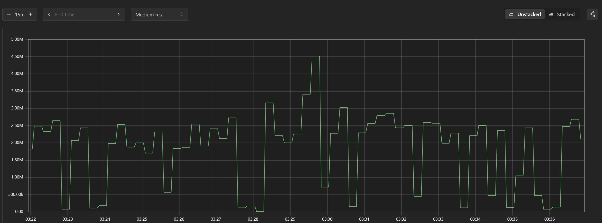

![실험B — rate(node_disk_written_bytes_total[1m])](./images/expB_disk_written.png)

![실험B — rate(prometheus_tsdb_wal_page_flushes_total[1m])](./images/expB_wal_flushes.png)

![실험B — rate(prometheus_tsdb_wal_record_parts_bytes_written_total[1m])](./images/expB_wal_bytes.png)

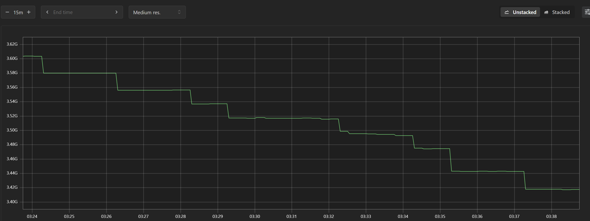

실험 B(40%)에서 기대했던 이상치가 명확하게 관측되지 않았습니다.

실험 A와 B가 비슷한 패턴을 보이고 있는데, 이유는 두 가지로 추측됩니다.

1. **VM의 총 메모리가 충분히 큽니다.**
   - 메모리가 크면 dirty_ratio 40%에 도달하는 데 훨씬 오랜 시간이 걸려서, 5분 실험 시간 안에 강제 flush가 발생하지 않았을 수 있습니다. (현재 환경은 6GB 메모리의 ubuntu instance)

2. **Prometheus의 데이터 적재량이 상대적으로 작습니다.**
   - avalanche가 생성하도록 설정한 10,000개 시계열은 VM 전체 메모리의 40%를 채울 만큼 빠르게 Dirty Page를 생성하지는 못했다고 추측할 수 있습니다.

**WAL은 세 상황(Baseline, A, B) 모두 동일**

WAL flushes와 WAL bytes는 세 실험에서 전혀 변화가 없습니다. 이것은 **WAL이 OS Page Cache와 완전히 독립적으로 동작한다는 것**을 실증한 것입니다.

**MemAvailable — 실험 B가 더 빠르게 감소**

실험 A보다 실험 B에서 MemAvailable이 더 가파르게 감소하고 있습니다. dirty_ratio가 높으면 Dirty Page가 더 오래 메모리에 머물기 때문입니다. (즉 Full Chunk가 mmap으로 매핑된 채 Page Cache에 Dirty Page로 더 오래 잔류하면서 가용 메모리를 지속적으로 점유하기 때문입니다.)

따라서 보다 큰 변화를 확인하기 위해 추가 실험을 더 진행하였습니다.

---

## 실험 C — dirty_ratio=1%

```bash
sudo sysctl -w vm.dirty_ratio=1
sudo sysctl -w vm.dirty_background_ratio=1

sysctl vm.dirty_ratio
sysctl vm.dirty_background_ratio
```

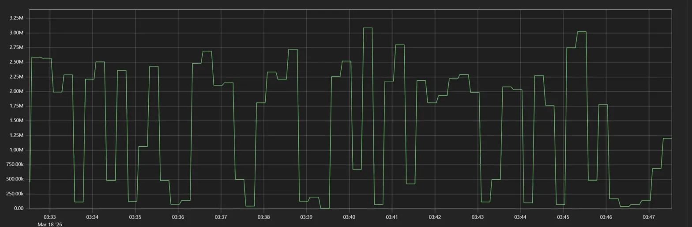

![실험C — rate(node_disk_written_bytes_total[1m])](./images/expC_disk_written.png)

![실험C — rate(prometheus_tsdb_wal_page_flushes_total[1m])](./images/expC_wal_flushes.png)

![실험C — rate(prometheus_tsdb_wal_record_parts_bytes_written_total[1m])](./images/expC_wal_bytes.png)

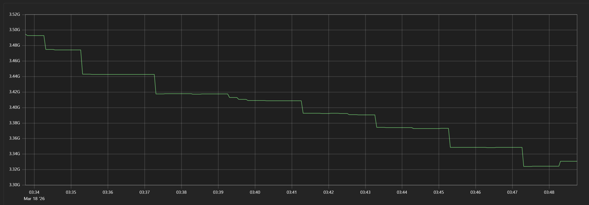

---

## 3개 실험 최종 비교

| 메트릭 | Baseline (20%) | 실험 B (40%) | 실험 C (1%) |
| --- | --- | --- | --- |
| Dirty_bytes | 간헐적 63M 스파이크 | 지속적 1.5\~5M | 지속적 0\~3M 극소 |
| disk_written/s | 간헐적 9M 스파이크 | 지속적 60k\~190k | 지속적 60k\~150k |
| WAL flushes/s | 규칙적 0.33\~0.63 | 규칙적 0.33\~0.63 | 규칙적 0.33\~0.63 |
| WAL bytes/s | 규칙적 4k\~12k | 규칙적 4k\~12k | 규칙적 4k\~12k |
| MemAvailable | 3.6G 안정 | 3.60→3.42G 감소 | 3.49→3.32G 가장 빠른 감소 |

**dirty_ratio=1%에서 확인된 결과**

```
Dirty_bytes  → 거의 0에 수렴 (즉시 flush로 인함)
MemAvailable → 가장 빠르게 감소 (3.49G → 3.32G, 15분간 170MB 감소)
               오히려 flush 행위 자체가 메모리에 영향이 크게 줌
WAL          → 여전히 변화 없음
```

**MemAvailable 감소 속도 비교**

```
Baseline    → 안정적 (거의 변화 없음)
실험 A (5%)  → 완만한 감소
실험 B (40%) → 완만한 감소
실험 C (1%)  → 가장 가파른 감소 (상대적)
```

dirty_ratio가 낮을수록 OS가 더 자주 메모리를 건드리면서 가용 메모리가 빠르게 줄어드는 것이 수치로 확인됩니다.

```bash
# 원복
sudo sysctl -w vm.dirty_ratio=20
sudo sysctl -w vm.dirty_background_ratio=10

sysctl vm.dirty_ratio
sysctl vm.dirty_background_ratio
```

---

## 번외: TSDB 블록 구조 확인

```bash
ls -la ~/study/prometheus/data/prometheus/
```

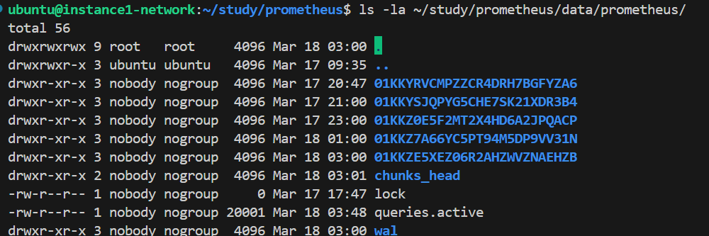

V3 prometheus의 macro 구조를 확인할 수 있었습니다!

---

## 결론

### WAL은 dirty_ratio와 완전히 독립적

세 실험 모두 WAL 메트릭이 동일했습니다.
WAL은 fsync를 통해 OS Page Cache를 완전히 우회하여 디스크에 직접 기록하기 때문입니다.

### dirty_ratio와 Write Amplification

dirty_ratio가 낮을수록 flush가 자주 발생하여 SSD 4KiB 페이지 Read-Modify-Write가 빈번해집니다.
이것이 Fabian 블로그에서 말한 Write Amplification의 실증입니다.

### 실험 환경의 한계

실험 B(40%)에서 스파이크가 관찰되지 않은 것은 Oracle Cloud VM의 충분한 메모리(5.5GB)로 인해 40% 임계값 도달 전에 background flush가 먼저 처리됐기 때문입니다.
더 작은 메모리 환경에서는 스파이크 패턴이 명확히 관찰될 것으로 예상됩니다.