## 컨테이너는 Host의 kernel을 공유한다

나름대로 더 좋은 실습 주제를 로우레벨 시스템설계의 카테고리 안에서 찾고자 고민하던 결과 정신차려보니 week4 주제와 크게 벗어난 실습이 된 점 먼저 사과드립니다...ㅜ


### 목표 
저는 컨테이너를 사용하다면 가끔 "쉽고 편리한 VM"으로 종종 착각하곤 합니다.

하지만 kernel의 입장에서 cgroup / namespace / chroot 같은 kernel 기능들로 격리된 "컨테이너는 그저 특수한 조건으로 격리된 일반 프로세스" 일 뿐입니다.   
따라서 전역 파라미터(Global Parameter)를 튜닝하게 되면 컨테이너들은 반드시 , 즉각적으로 이에 영향을 받습니다.  
목적에 따라서 컨테이너에서만 적용되게 파라미터를 튜닝하기 위해서는 튜닝하고자하는 파라미터가 namespace 단위로 튜닝을 지원하는지 체크할 필요 역시 있습니다.

본 실습의 목적은 컨테이너가 Host 커널을 공유한다는 사실을 단순 확인하는 것을 넘어,

1. 커널 전역 파라미터(Global sysctl)의 변경이 컨테이너 워크로드에 미치는 영향을 metric으로 측정하고,
2. namespace 기반으로 격리되는 파라미터와 그렇지 않은 파라미터를 실험적으로 구분하며,
3. 해당 차이가 실제 서비스 성능 및 안정성에 미치는 영향을 유추해보는 것 

을 목표로합니다.


### 시나리오


2개의 모든 시나리오는 동일한 실행 패턴으로 설계합니다.  
**Before 수집** : 실습 전의 기준을 측정하고 기록합니다.  
**파라미터 변경** : sysctl 명령어를 통해서 파라미터를 조정합니다.  
**워크로드 투입** : 실제 환경에 부하 테스트를 진행합니다.  
**After 확인** : 테스트가 끝난 후 Before 수집 단계와 동일한 수치를 재검증하고 결론을 지어봅니다.


#### 시나리오 1 : 메모리 스왑 정책 튜닝 (전역 파라미터)


**목표** : Memory swap 정책을 전역단위로 설정하고 컨테이너에 스트레스 테스트를 가함으로써 호스트와 컨테이너 양쪽의 Swapused 관측 

**검증 가치** : 컨테이너의 독립성을 믿고 호스트 전체가 영향을 받는 현상의 검증

대상 파라미터  
**vm.swappiness** : 스왑 메모리의 활용 수준 조절 / 스왑 사용의 적극성 수준  
**vm.overcommit_memory** : overcommit의 기준치를 정하는 파라미터

0 : 휴리스틱하게 설정한다. 기본값. Page Cache+ Swap Memory + Slab Reclaimable을 합친수 가 요청보다 클 때 commit 발생  
1 : 메모리 할당을 반드시 성공시킨다. 사실상 무제한 모드  
2 : CommitLimit을 반드시 지키는 설정


```azure
linux에서 memorycommit 이란?
프로세스가 커널에게 메모리 요청을 할 때, 시스템 콜을 이용하게 되는데 커널은 시스템 콜 요청을 받고 해당하는 메모리 영역의
주소를 전달자로 넘겨주게 되는데, 이 때 프로세스가 할당 받아도 사용하지 않을 수 있기 때문에 할당해준 메모리의 영역을 
물리 메모리에 바로 바인딩하지는 않는다. 프로세스는 받았다고 생각하지만 실제로는 물리메모리 어느 곳에도 할당 되어지지 않은 상태.
```

```azure
그렇다면 overcommit은?
쉽게 정의하면 가진 것보다 더 많은 메모리를 약속할 수 있는 옵션이다.
왜 이런 옵션이 있을까?
```
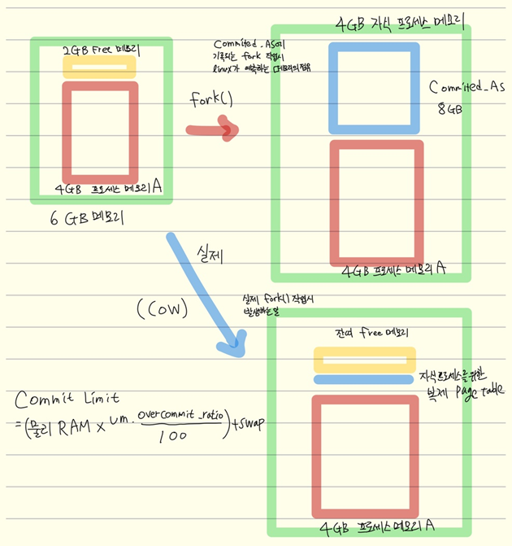

위 그림을 예시로 들어보겠습니다.
프로세스 A(4GB)가 fork()를 호출하면, 리눅스 커널은 자식 프로세스에게 부모와 동일한 크기의 가상 주소 공간을 할당합니다.   
이때 시스템 전체의 **Committed_AS**는 두 프로세스의 가상 메모리 합계인 8GB로 치솟으며 물리 RAM(6GB)을 초과하게 됩니다.  
하지만 실제 물리 RAM에서는 4GB의 데이터 복제가 일어나지 않습니다.   
CoW (Copy-on-Write) 기술 덕분에 자식 프로세스는 부모의 물리 메모리 공간을 그대로 공유하며, 커널은 오직 자식 프로세스를 위한 최소한의 **페이지 테이블(Page Table)**만을 복제하여 할당합니다.  
결과적으로 Committed_AS는 8GB이지만, 실제 물리 메모리 사용량은 4GB와 미세한 페이지 테이블 용량만큼만 유지하면 됩니다.  
이처럼 실제 자산보다 더 많은 메모리 할당을 승인해 주는 상태가 바로 오버커밋(Overcommit) 정책이 작동하는 지점입니다.

**Commit Limit** 이란?  
하지만 시스템이 무한정 약속(Commit)을 남발할 수는 없으므로, 커널은 **Commit Limit**이라는 상한선을 둡니다.   
계산된 한도 내에서만 Committed_AS의 증가를 허용하며, 이 한도를 넘어서는 순간 더 이상의 fork()나 메모리 할당은 실패하게 됩니다.


수집 Metric :  
node_exporter  
node_memory_SwapTotal_bytes - node_memory_SwapFree_bytes : 현재 스왑 사용량  
node_memory_MemAvailable_bytes : 가용 메모리

cAdvisor  
container_memory_swap : 컨테이너 스왑 사용량  
container_memory_usage_bytes : 메모리 사용량 추이  
container_oom_events_total : OOM 킬 감지 

실습  

**Before 수집** : 스왑 사용량 기준선과 파라미터 현재값 수집 

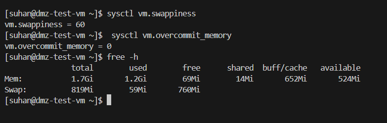  
현재 파라미터 설정값 확인


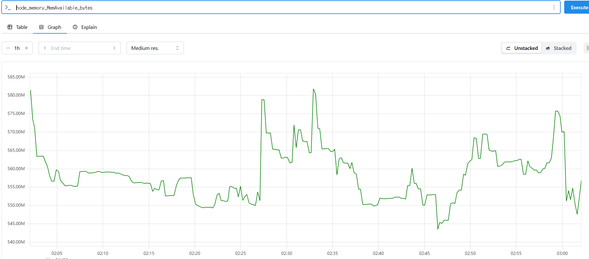

현재 가용 메모리 : 550M~580M

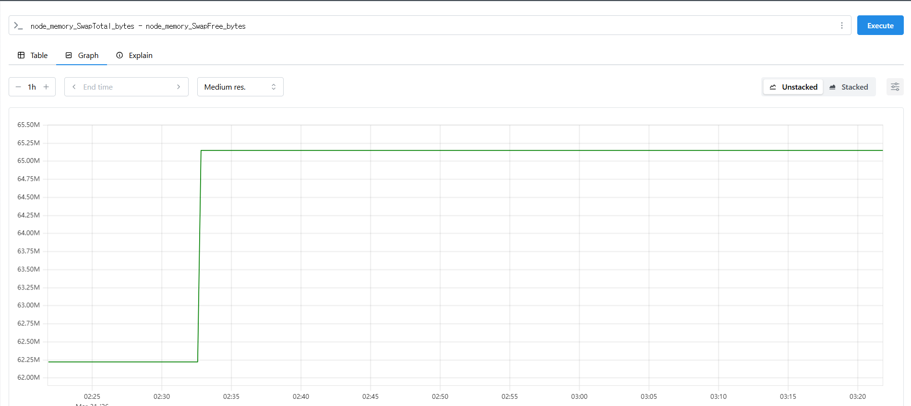 

현재 swap 메모리 사용량 : 대략 65M(swap 최대 820)

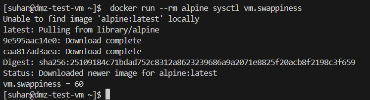

일시적 컨테이너 생성 후 vm.swappiness 확인 : 60으로 동일


**파라미터 변경** : 스왑 적극성 조정 — 극단값으로 차이를 극대화

**[페이즈 1]**

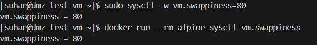

페이즈 1에서는 단순히 공격적인 swap 메모리 정책을 설정하여 전역 파라미터 튜닝이 컨테이너에 어떤 영향을 끼치는지 확인해봅니다.

**[페이즈 2]**  

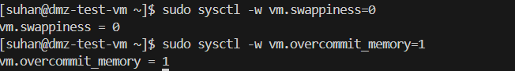

페이즈 2에서는 극도로 방어적인 (사실상 허용하지않는) swap 정책을 세우고 그와 반대로 무조건 수용적인 overcommit 정책을 설정합니다.
모순적인 정책인데, 요구하는 메모리량이 얼마나 되던지 간에 overcommit 에서 이를 수용하지만, 정작 swap을 허용하지 않기때문에  
물리적 RAM을 초과하는 작업이 발생할 시 OOM이 뜰 것으로 예측된다.


**워크로드 투입** : 컨테이너 내부에서 메모리 압박 발생  

```azure
docker run --rm --name stress-lab     --memory=350m     polinux/stress-ng     stress-ng --vm 2 --vm-bytes 250m
```
--memory=350m : cGroups 기능을 통해서 컨테이너의 Ram 사용량을 350mb로 제한합니다.  
stress-ng : 리눅스에 부하를 겁니다.  
--vm 2 : 부하를 일으킬 프로세스 2개를 지정합니다.  
--vm-bytes 250m : 각 프로세스가 사용할 메모리크기를 250mb로 지정합니다.

페이즈 1과 페이즈 2 동일한 컨테이너 실행 조건으로 테스트하고 전역 설정에 따라 컨테이너 워크로드의 변화를 알아보겠습니다.

**[페이즈 1]**

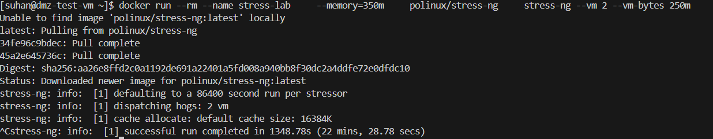

명령어를 실행해 테스트를 진행하고 충분히 대기해준 후 종료합니다.

**[페이즈 2]**

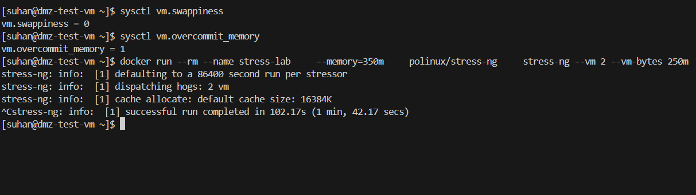

명령어를 실행해 테스트를 진행하고 충분히 대기해준 후 종료합니다.

**After 확인** : 호스트 전체 메모리/스왑 변화 와 컨테이너 메모리 메트릭 확인  

**[페이즈 1]**

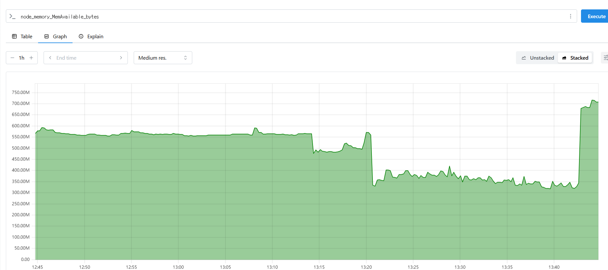

공격적인 swap 메모리 정책이 적용되어서 컨테이너 실행 후 컨테이너가 350MB 의 메모리를 요구함에도 
550MB > 300-450 MB 정도의 가용 메모리가 방어된 모습이다.  
즉 컨테이너에서 실질적으로 점유하는 물리RAM 의 자원은 100-250MB 안쪽으로 이루어진 것이다.

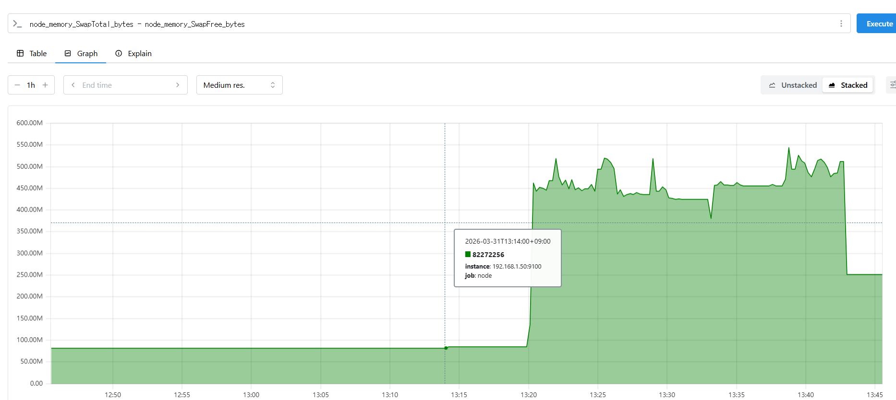

그에 반면 (토탈 swap 메모리 허용량 - 가용가능한 swap 메모리의 허용량)은 크게 늘었다.  
이는 swap 메모리가 많이 사용되고 있다는 것을 의미한다.

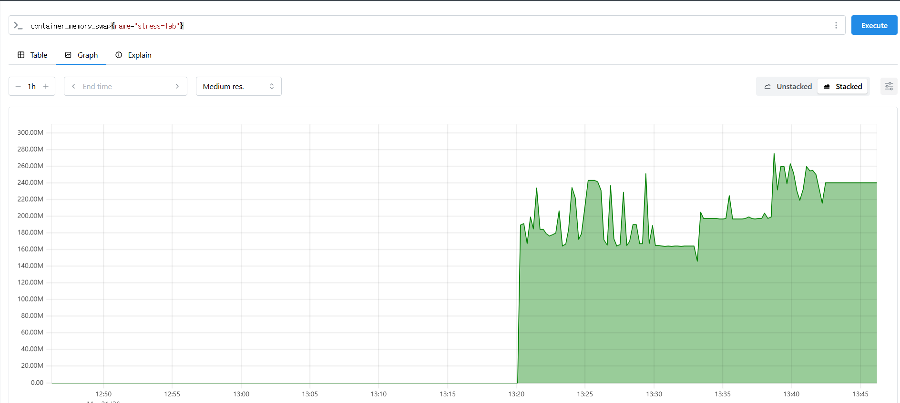

cAdvisor를 통해 좀 더 직관적으로 컨테이너의 swap 메모리양을 체크할 수있다.

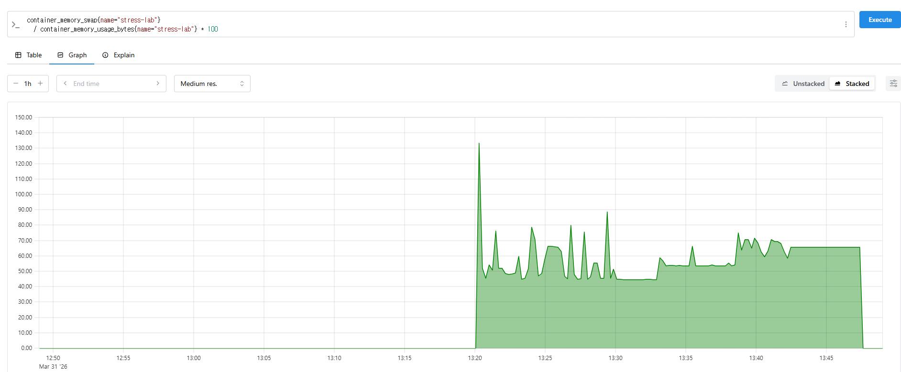  

swap 메모리의 사용량과 물리 RAM 의 사용량의 비율적으로 나타낸 것이다.

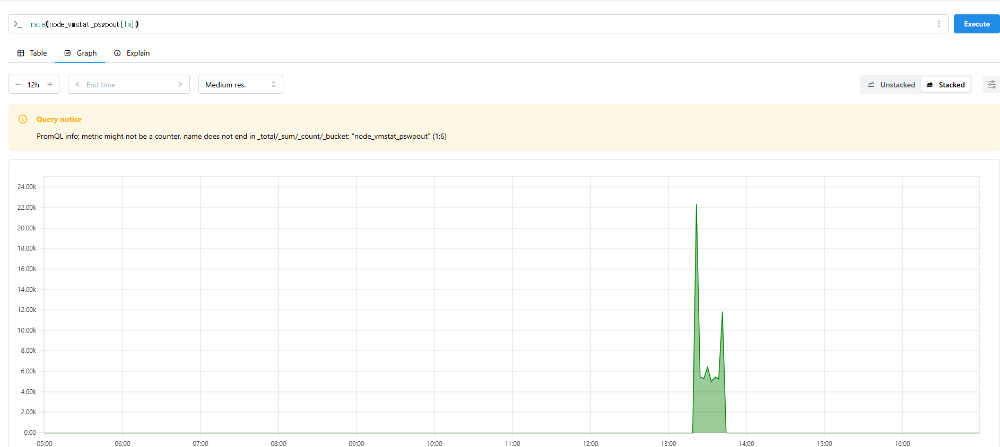

해당 프로세스가 가동된 시간대에 급증한 디스크 쓰기 속도이다. 메모리가 부족해 디스크에 데이터를 쓴 흔적이고,  
이는 곧 성능저하와 직결된다.

**[페이즈 2]**

우선 페이즈 1이랑 다르게 실행하는 시점에서 dmesg -w 를 통해 커널을 모니터링 해보았는데...

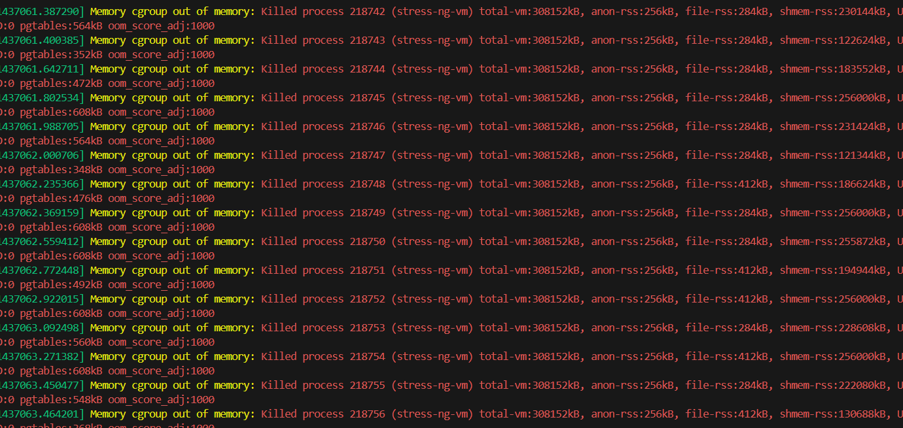

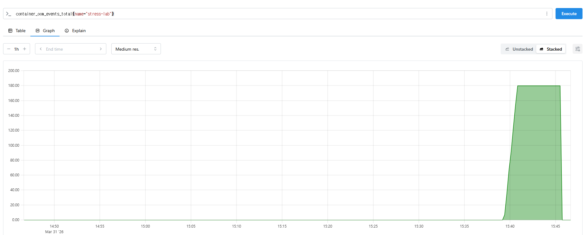

예상대로 미친듯이 oom이 발생하고 있었다.

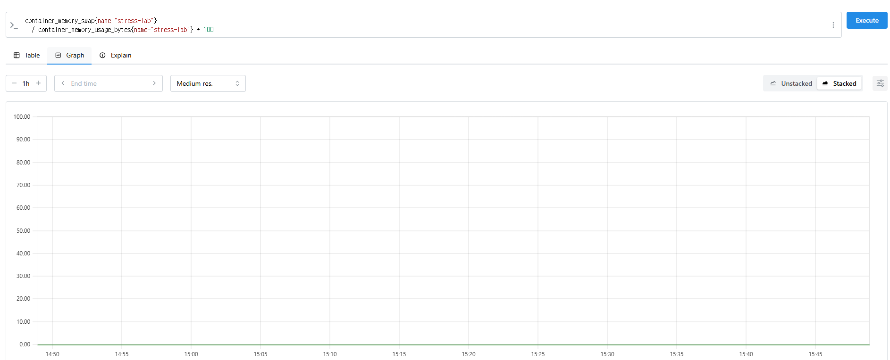

컨테이너 내부에서 그 난리가 났음에도 swap 메모리의 비율은 0을 유지하고 있는 모습을 관측할 수 있었다.

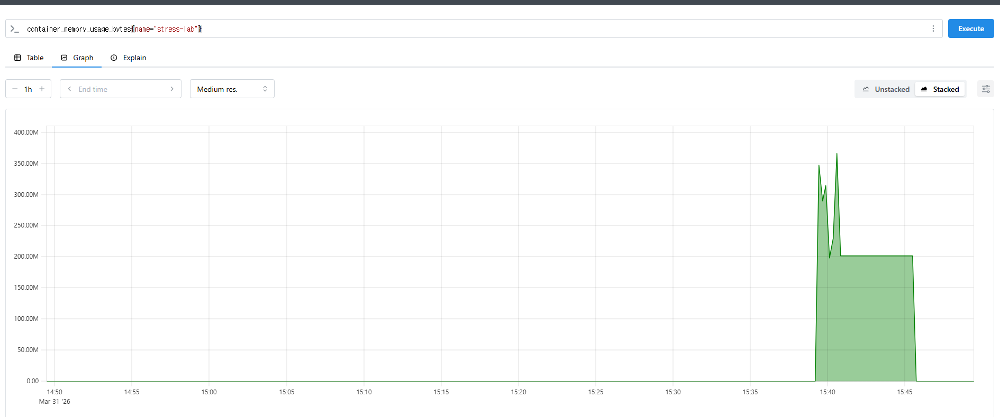

Committed_AS에서는 사실상 제한없는 memorycommit을 허용하고 있지만 cgroup에서 이를 용납하지 않고,  
이를 보완하기 위한 swap 메모리가 swappiness = 0으로 극단적으로 방어적으로 되어있기 때문에 kernel에서는 컨테이너 내 2개의 부하 프로세스 중 하나를
계속하여 oom으로 kill 하였다. 프로메테우스의 metric 수집 타임스탬프 차이는 15에서 30초 주기이기 때문에
초반을 제외하면 이후로는 마치 컨테이너가 안정적으로 작업을 수행하는 거처럼 평탄한 메모리 점유율을 보이는데,  
(죽지 않은 프로세스 A가 200MB 정도의 메모리를 쓴 시점에서 oom이 발생한 것으로 추정) 그 안에는 3~4분 남짓한 시간동안  
180번의 oom이 발생하고 있었다. 이는 즉, 메모리 점유율 지표만 맹신할 수 없음을 의미한다.


**[결론 및 더 생각해볼 점]**

여기서 의문이 생기는 것이 많았지만 가장 궁금한 것은 

_swapiness를 0으로 유지하고 overcommit = 2로 설정한 뒤, CommitLimit을 빡빡하게 설정하면 다른 결과가 나올까?_ 

이때까지 실습으로 유추했을 경우, 만약 commitlimt - committed_as가 500mb 미만일 경우 시작조차 하지 않을 것이라고 생각된다.  
맞는지 한 번 검증해보자.


overcommit_ratio 파라미터를 110 으로 설정하여서 committed_as(address space)보다 약간의 여유가 있도록 설정하였다.
처음에 overcommit_ratio 파라미터가 기존에는 50이었고, commitlimit 가 committed_as 보다 낮은 상태에서
확인도 안하고 overcommit=2 를 키자마자 서버가 마비되어버렸다.. 만약 이를 영구 설정으로 해놨었다면 꼼짝없이 복구모드에 들어가야 했을 것이다.
의도치 않았지만 memmorycommit 의 중요성을 체감하였다.

```azure
왜 마비가 되었을까?
기존에 실행 중이던 프로세스들도 새 메모리 할당에 실패하기 시작하고, 시스템 데몬들까지 영향받아 마비되는 것이다.
```

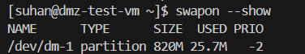

swap 메모리 설정은 다음과같다. 위와 같은 파라미터를 튜닝하고 똑같이 워크로드를 실행해보겠다.

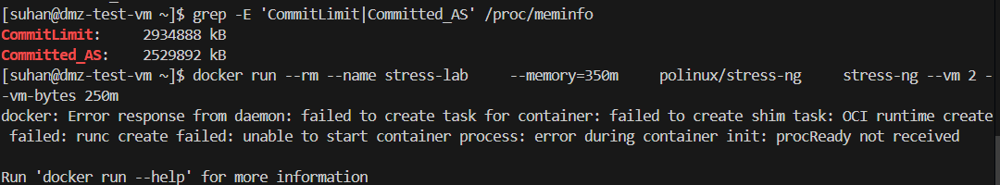

컨테이너가 실행조차 되지 않는 것을 확인할 수 있었다.


본 실습을 통해서 전역 커널 파라미터 튜닝 (swap과 overcommit의 설정)을 통해서 같은 컨테이너 워크로드라도  
아예 다른 결과가 나올 수 있음을 직접 확인해 볼 수 있었다.  
개인적으로 인상 깊었던 것은 페이즈2에서 container_memory_usage_bytes{name="stress-lab"} 의 그래프가  
초반의 굴곡을 제외하면 마치 시스템의 문제가 없는 것처럼 안정적인 그래프를 그렸다는 것이다.  
결국 지표는 지표일 뿐이며, 시스템의 진실을 파악하기 위해선, 이벤트와, 로그를 확인하고 kernel의 동작원리를 파악하고 입증해야 한다는 것을 깨달았다.

그리고 커널 파라미터 튜닝 값에 따라 다른 결과를 가져온 컨테이너 워크로드를 보며 다르게 튜닝한다면 어떨까 궁금해서 지피티에게 물어보았다.

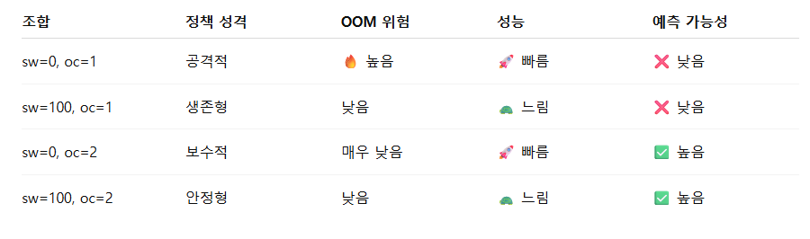

위와 같다고 한다. 그렇다면 본인의 시스템의 방향성에 맞게 커널 파라미터를 조정함으로써 원하는 시스템의 방향성에 맞는 인프라를 구축할 수 있다는 것을 더욱 더 직접적으로 깨닫게 되었다.

처음에는 컨테이너는 호스트의 커널을 공유하고 있다는 것을 입증하고, 거기서 컨테이너의 워크로드로 인해 호스트
가 영향을 받는 것을 검증하자는 취지에서 시작한 실습이지만 그걸 넘어서 추가로, 목적에 따른 튜닝의 다양성과 지표를 맹신해서는 안되는 근본적 이유를
이해하게 된 실습이었다.


[//]: # (#### 시나리오 2 : Net namespace 스코프 파라미터 튜닝 &#40;Namespace 파라미터&#41; )

[//]: # ()
[//]: # (**목표** : --sysctl 플래그로 컨테이너별로 다른 값을 주입해서, 같은 호스트 위에서 컨테이너 A와 B의 메트릭이 서로 다르게 나오는 것을 관찰)

[//]: # (**검증 가치** : 성능 최적화가 필요한 특정 애플리케이션만 호스트 영향 없이 튜닝할 수 있는가?의 검증)

[//]: # ()
[//]: # (대상 파라미터)

[//]: # ()
[//]: # (**net.ipv4.ip_local_port_range** : 리눅스 커널이 외부로 나가는 연결을 생성할 때 사용할 수 있는 임시 포트의 범위를 지정  )

[//]: # (**net.ipv4.tcp_fin_timeout** : TCP 연결이 종료될 때 FIN-WAIT-2 상태로 머무는 시간을 설정  )

[//]: # ()
[//]: # (```azure)

[//]: # (FIN-WAIT-2 란?)

[//]: # (TCP 연결이 종료될때의 순서는 다음과 같다.)

[//]: # (1. 클라이언트가 FIN 패킷을 보내면서 연결 종료 요청 → FIN-WAIT-1)

[//]: # (2. 서버가 ACK를 응답하면 → FIN-WAIT-2)

[//]: # (3. 서버가 나중에 자기 쪽 FIN을 보내면 → TIME-WAIT 혹은 세션 종료)

[//]: # ()
[//]: # (해당과정에서 서버가 fin을 보내지 않거나 유실된경우, FIN-WAIT-2 에서 대기하게 된다.)

[//]: # (```)

[//]: # ()
[//]: # (수집 Metric  )

[//]: # (node_exporter  )

[//]: # (**node_sockstat_TCP_tw** : TIME_WAIT 소켓 수  )

[//]: # (**node_sockstat_TCP_alloc** : SYN 재전송 수  )

[//]: # ()
[//]: # (**container_network_transmit_errors_total** : 컨테이너별 에러 비율 비교  )

[//]: # (**container_network_receive_bytes_total** : 처리량 비교  )

[//]: # ()
[//]: # (**단계**  )

[//]: # (**Before 수집** : 호스트 파라미터 기본값 확인 + 네임스페이스 스코프 여부 식별  )

[//]: # (**파라미터 변경** : --sysctl 로 컨테이너별 Net NS에 다른 값 주입 — 호스트는 그대로  )

[//]: # (**워크로드 투입** : 동시 연결을 폭증시켜 포트 고갈 차이를 유발  )

[//]: # (**After 확인** : NS 격리가 호스트 지표에 어떻게 보이는가 / A와 B의 에러율·처리량이 실제로 갈라지는 것을 관측  )

[//]: # ()
[//]: # (실습)