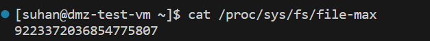
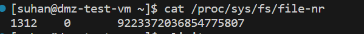
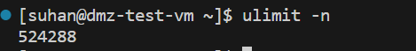
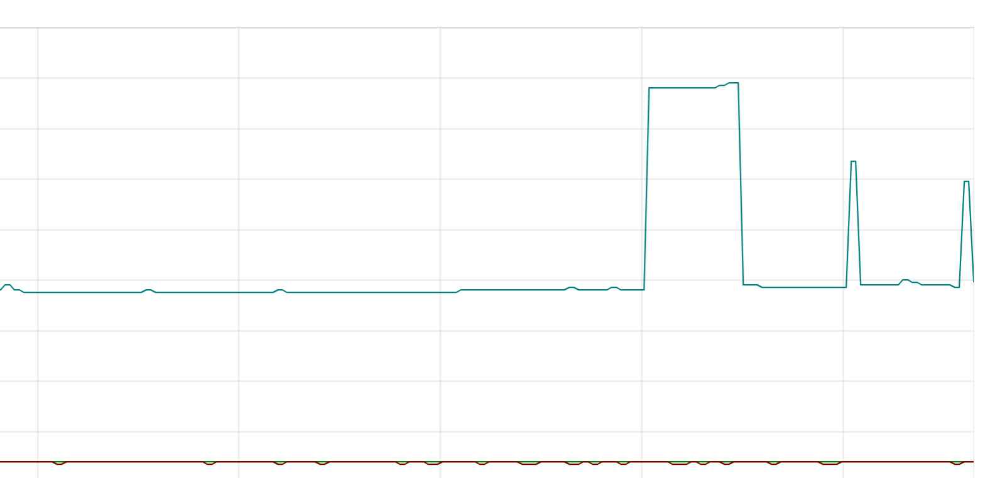

## fs.file-max와 ulimit를 통한 다수 Block 동시 쿼리 시 FD 고갈

쿼리가 여러 persistent block에 걸쳐 N-way merge를 수행할 때, 각 block의 chunk 파일 FD를 동시에 열어야 한다.

### fs.file-max 란?

`file-max is the maximum File Descriptors (FD) enforced on a kernel level, which cannot be surpassed by all processes without increasing. The ulimit is enforced on a process level, which can be less than the file-max.
`

filemax란 쉽게 말하여 리눅스 커널이 동시에 열 수 있는 file handle의 갯수를 조정하는 Global kernel parameter이다.
해당 갯수보다 많이 file handle open이 발생하면 에러가 발생하며 해당하는 에러메시지는

`Too many open files` 가 이에 해당한다.
확인 경로는 '/proc/sys/fs/file-max' 에 해당한다.

### ulimit -n란? 

**특정 프로세스가 동시에 열 수 있는 파일 디스크립터(FD)의 개수를 제한하는 값**이다.

**여기서 파일 FD란?**

`리눅스나 유닉스 계열 운영체제에서 프로세스가 특정 파일이나 네트워크 소켓, 파이프 등 **I/O 자원에 접근하기 위해 사용하는 '추상적인 번호'`

파일 FD의 핵심 특징

정수형 식별자: 커널이 프로세스에게 부여하는 0 이상의 정수 값  
자원 관리의 단위: 프로세스가 파일을 하나 열 때마다 FD 번호가 하나씩 할당되며, 사용이 끝나고 파일을 닫으면 해당 번호는 다시 반환  
제한된 자원: 시스템 전체(fs.file-max) 혹은 개별 프로세스(ulimit -n)가 동시에 가질 수 있는 FD의 개수에는 제한  

프로메테우스는 데이터를 2시간(기본값) 단위의 '블록'으로 저장합니다. 각 블록 안에는 메타데이터, 인덱스, 그리고 실제 데이터가 담긴 청크(Chunk) 파일

**N-way Merge**

만약 30일치 데이터를 조회한다면 약 360개 이상의 블록에 동시 접근해야 하며, 각 블록마다 여러 개의 파일을 열어야 하므로 순식간에 수천 개의 FD를 소모

LabelNames() 및 LabelValues() : 모든 블록에서 정렬된 레이블 이름과 값들을 가져와 N-way 병합 수행  
Select()를 통한 지연 병합(Lazy Merge)   
각 블록의 시리즈 반복자(Series Iterator)를 가져와 지연(Lazy) N-way 병합 방식으로 결합  
동시 오픈 상태 유지: 쿼리가 완료될 때까지 모든 관련 블록의 파일(인덱스, 청크 등)에 대한 연결 통로(FD)를 동시에 계속 열어두어야
 

## 튜닝 실습

